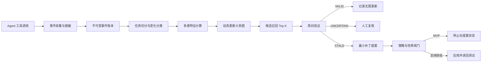

# 轨迹驱动的动态制品更新图总体技术方案

## 摘要

超长程 Agent 会持续接触代码、测试、配置、设计文档、计划、研究记录和运行手册。随着任务推进，真正需要维护的关系常常没有静态引用，且无法靠一个不断扩大的索引文件完整表达。当前做法通常依赖模型在当次上下文中的注意力判断“还应该检查什么”。一旦上下文压缩、任务切换或多个 Agent 并行，这些隐含关系容易丢失。

本方案把 Agent 的工具使用轨迹视为项目依赖关系的在线观测信号。系统将轨迹证据、版本历史、静态依赖、显式引用和语义证据聚合成一个有方向、带类型、随时间更新的 Artifact Update Graph。图回答“某类变化发生后，哪些制品值得检查”；独立验证器回答“源制品的这次差异是否使目标制品中的具体陈述失效”。补丁生成和写回位于后续治理阶段，与图计算保持隔离。

建议先建设一个只读 Demo，验证受影响制品召回、陈旧判断和自强化控制。只有这些环节通过离线评测和人工审查后，才讨论低风险制品的自动应用。

## 问题定义

设项目包含制品集合 \(V\)，制品可以是文件、文件内的稳定片段、数据库模式、测试、配置项、运行手册、计划或外部版本化记录。一次变更为 \(\Delta A\)，其中包含源制品、前后版本、差异、变化类型和任务上下文。

系统要估计的不是无条件相关度 \(Related(A,B)\)，而是：

\[
P(ReviewOrUpdate(B) \mid \Delta A, ChangeType, TaskContext, Evidence)
\]

这一定义包含三个不同问题：

1. 候选召回：变化发生后，哪些制品可能受影响。
2. 陈旧验证：目标制品中是否存在已被当前变化推翻或需要复核的陈述。
3. 变更治理：发现陈旧后，系统可以提出、应用或发布何种修改。

三个问题必须分别评测。候选分数高不能代替陈旧证据，陈旧证据也不能代替写回授权。

## 核心概念

### Artifact

Artifact 是可以被版本化、引用、检查或修改的工作制品。MVP 以文件为主节点，同时允许记录文件内的 claim span。建议的首批类型包括：

- source code
- test
- configuration
- schema or contract
- design documentation
- runbook
- execution plan
- generated report

### Tool trace

Tool trace 是 Agent 与环境交互的顺序事件流。它至少记录事件标识、任务标识、顺序号、操作类型、目标制品、前后哈希、结果状态、父事件、时间和访问来源。默认不保存原始密钥、完整提示词或不必要的文件内容。

### Update obligation

Update obligation 是一个条件化、有方向的审查或更新义务。相同的两个制品在不同变化类型下具有不同边权。例如，函数内部重构对 API 文档的更新义务应很低，而公共接口字段改变时应显著升高。

### Staleness

Staleness 表示目标制品中的某个可定位陈述与当前权威证据不一致，或其成立条件已经改变。验证器输出 `VALID`、`STALE`、`UNCERTAIN` 或 `NOT_APPLICABLE`，并附上目标片段、证据标识和判定依据。`UNCERTAIN` 必须停止自动流程。

### Origin

每个访问事件都要标记来源：`organic`、`system_recommended`、`human_directed`、`replay` 或 `unknown`。系统推荐后发生的读取不能与 Agent 自发发现的读取等权训练，否则图会把自己的推荐逐步强化为高置信关系。

## 目标与非目标

| 目标 | 非目标 |
| --- | --- |
| 从真实工具轨迹中学习跨代码和文档的候选更新义务 | 建造一个覆盖所有项目知识的通用知识图谱 |
| 在变化发生时召回需要复核的制品，并提供可解释证据 | 让相关度分数直接控制文件写回 |
| 通过独立验证减少错误更新和无意义检查 | 在 MVP 中使用 GNN 或端到端强化学习 |
| 支持确定性回放、审计、拒绝和回滚 | 宣称 Demo 已证明生产自治安全 |
| 区分自发行为与系统诱导行为 | 将 Agent 行为视为无偏的因果真值 |

## 设计原则

### 先观测再干预

第一阶段只记录行为并离线重放，不改变 Agent 的工具选择。只有形成基线后，系统才向 Agent 提供候选提示。这样可以分别测量自然轨迹和系统干预后的轨迹。

### 图提供历史先验

图的作用是缩小搜索空间，并说明候选为何被召回。最终判断仍依赖当前差异、目标内容、权威来源和验证证据。图不能替代当前状态读取。

### 写回与推断隔离

候选检索、陈旧验证、补丁生成、补丁应用和正式采纳使用不同状态与权限。任一阶段失败都不得把后续状态写成成功。

### 证据可重放

每次判断记录输入版本、策略版本、特征版本、模型版本、候选列表、证据引用和输出摘要。相同的冻结输入应能生成相同的特征和排序；包含非确定性模型的步骤应记录原始响应摘要和随机性配置。

### 默认拒绝

缺少目标哈希、来源不明、策略无法解析、验证器不确定或受保护制品命中时，系统停止在只读状态。禁止通过重试绕过治理拒绝。

## 证据信号

MVP 合并以下信号，但保留每类信号的独立贡献，便于消融和解释：

| 信号 | 示例 | 主要局限 |
| --- | --- | --- |
| 有序工具轨迹 | 修改 A 后搜索概念并编辑 B | 会受 Agent 策略和推荐干预影响 |
| 失败链 | 编辑 A 后测试失败，随后修复 B | 需要可靠的父事件和错误归因 |
| Git 共变更 | A 与 B 在历史任务中经常共同提交 | 大型提交会产生大量伪关系 |
| 静态依赖 | import、调用、模式引用 | 难以覆盖文档、计划和组织依赖 |
| 显式引用 | Markdown 链接、路径、符号名 | 引用存在不代表内容已受影响 |
| 语义证据 | 描述同一契约或业务规则 | 相似不等于更新义务 |
| 任务族 | A 与 B 经常出现在同类任务 | 任务分类错误会扩散到边权 |

## 总体流程

### 生命周期

1. Agent 执行任务，采集器记录工具事件。
2. 任务完成或形成稳定变更点后，系统生成 ChangeEvent。
3. 特征构建器以时间衰减、任务规模归一化和来源校正更新图边。
4. 候选检索器结合变化类型和目标敏感度输出 Top K。
5. 验证器从候选中提取可核验陈述，并只使用冻结证据判断当前状态。
6. 补丁生成器为 `STALE` 陈述产生最小差异及预期旧哈希。
7. 策略引擎决定 `PROPOSE_ONLY`、`REVIEW_REQUIRED` 或后续阶段的 `AUTO_APPLY_ALLOWED`。
8. 写入器在目标哈希仍匹配时应用补丁，随后独立读回并运行约定测试。
9. 人工接受与正式来源更新由独立状态记录。

## Demo 场景

样例仓库包含认证代码、测试、设计文档和配置。Agent 将公共字段从 `user_id` 改为 `subject_id`。静态调用图可以找到直接依赖，却不会自然连接到描述旧字段的设计文档。历史轨迹和显式符号证据使该文档进入候选列表，验证器定位旧陈述并提出一个只替换契约描述的补丁。

同一仓库随后执行负对照：仅重命名函数内部局部变量。相关文件仍可能具有较高历史相关度，但变化影响分数接近零，验证器应返回 `VALID` 或 `NOT_APPLICABLE`，不产生补丁。

第三个场景模拟一次涉及大量文件的机械格式化。系统将任务表示为 hyperedge 或对大任务降权，避免把所有文件两两连接。

## 与已有工作的关系

OpenAI 的 harness engineering 实践把仓库知识组织成版本化的 system of record，并使用检查和周期性 doc gardening 处理陈旧文档。本方案把触发时机前移到实际变化发生时，并尝试从 Agent 行为中学习需要检查的目标。

软件工程研究长期使用 logical coupling、version history mining 和 temporal graph 预测共同变化。文档陈旧检测工作则可通过符号引用发现代码元素已经消失但文档仍保留旧引用。本方案拟研究的增量是把完整工具轨迹、变化类型、跨类型制品、独立陈旧验证和干预偏差控制放入同一条可审计流水线。该增量目前是研究假设，需由第 04 号文档中的对照实验确认。

## MVP 成功条件

以下均为建议门槛：

- 冻结轨迹可确定性重放，事件与特征账本完整率为 100%。
- 在人工标注的 Demo 集上，候选 `Recall@10` 达到 0.80 以上。
- 与不含工具轨迹的最佳基线相比，完整模型的 `Recall@10` 有正向提升，且任务级 bootstrap 置信区间不跨零。
- 负对照中的错误补丁提案率不高于 5%。
- 每个 `STALE` 结论都包含目标片段、源差异、证据标识和冻结版本。
- 系统诱导访问不会按有机访问的权重更新边。
- MVP 演示全程不执行真实自动写回。

这些门槛用于决定是否继续研发，不构成当前结果。

## 建议决定

按四周计划启动单仓库 MVP，先冻结契约和评测，再实现采集、图构建、召回和验证。系统在 `PATCH_PROPOSED` 状态停止。只有候选召回、负对照、自强化防护和证据完整性同时达标，才进入受控沙箱中的低风险写回实验。

