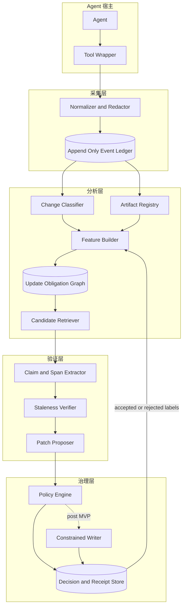
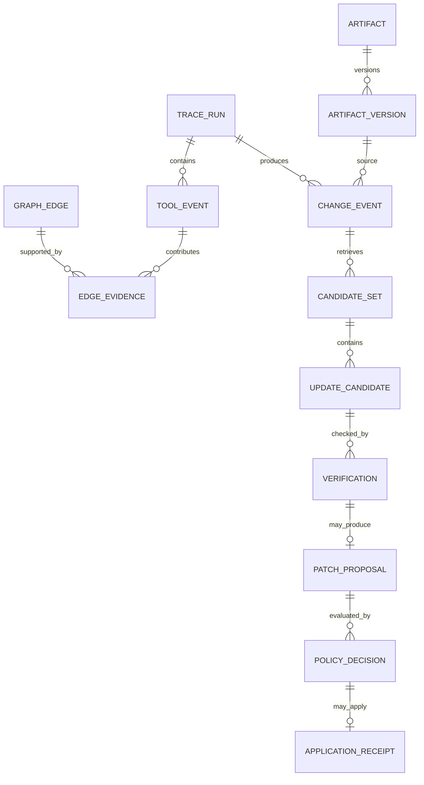

# 轨迹驱动的动态制品更新图系统架构与数据模型

## 架构决定

MVP 采用本地优先、事件溯源、单仓库、离线回放架构。SQLite 保存不可变事件、制品版本、边证据和决策记录；图计算使用关系表和增量聚合，不引入图数据库。Agent 宿主通过薄适配器输出规范化事件，分析核心不依赖具体模型供应商。陈旧验证器可以调用语言模型，但必须通过窄接口接收冻结证据，且没有写文件工具。

系统默认停止在补丁提案状态。事件采集、推断、验证、补丁生成和写入使用分离的权限与状态表。

## 系统边界

### 边界内

- 采集 Agent 工具调用的元数据和受控差异摘要
- 建立制品注册表和版本快照
- 从工具轨迹、Git、静态关系、显式引用和语义证据计算边特征
- 生成有方向、带变化类型的候选更新义务
- 对目标制品中的具体陈述执行陈旧验证
- 生成不落盘的最小补丁提案
- 保存审计记录、评测标签和人工决策

### 边界外

- 代替 Git、文档库或数据库成为正式来源
- 在没有明确策略和新鲜授权时修改受保护制品
- 捕获或长期保存完整提示词、密钥和所有文件正文
- 用图分数推断业务真值或因果关系
- 在 MVP 中自动提交、推送、开 PR 或合并

## 逻辑架构



## 组件职责和失败行为

| 组件 | 输入与输出 | 持久状态 | 失败行为 |
| --- | --- | --- | --- |
| Tool Wrapper | 宿主工具请求与结果 → 原始事件 | 无或短时缓冲 | 不阻断宿主任务；记录采集缺口 |
| Normalizer and Redactor | 原始事件 → 规范事件 | 脱敏规则版本 | 无法判定敏感性时丢弃正文，只保留最小元数据 |
| Event Ledger | 规范事件 → 可重放序列 | SQLite WAL | 写入失败时标记 trace incomplete，不允许训练或自动决策 |
| Artifact Registry | 路径、类型、哈希、版本 | artifact 和 artifact_version | 路径越界或符号链接逃逸时拒绝登记 |
| Change Classifier | 差异和上下文 → 变化类型与影响 | change_event | 不确定时使用 `unknown`，提高复核要求 |
| Feature Builder | 多源证据 → 版本化特征 | edge_evidence 和 feature snapshot | 单一信号失败时降级，但必须记录缺失特征 |
| Update Graph | 特征 → 方向性边与分数 | graph_edge | 版本不一致时不覆盖旧图，生成新快照 |
| Candidate Retriever | 变化事件与图 → Top K 候选 | candidate_set | 无证据时返回空集，不扩大到全仓库写入 |
| Staleness Verifier | 冻结差异、目标片段、权威证据 → 判定 | verification | 超时、冲突或证据不足时返回 `UNCERTAIN` |
| Patch Proposer | `STALE` 证据 → 最小补丁 | patch_proposal | 无法生成局部补丁时仅给出人工说明 |
| Policy Engine | 提案、制品等级、信心、策略 → 动作 | policy_decision | 未知策略值一律拒绝 |
| Constrained Writer | 经批准提案和预期哈希 → 应用结果 | application_receipt | 哈希漂移、测试失败或越界时停止并保留工作副本 |

## 事件生命周期

### 事件进入

每个宿主适配器在工具调用前生成 `event_id` 和单调递增的 `sequence_no`。工具完成后补充结果状态、目标哈希和摘要。采集器以 `(trace_id, sequence_no)` 作为幂等键；重复事件必须内容一致，否则记录 `IDEMPOTENCY_CONFLICT`。

### 规范化

规范化器执行以下步骤：

1. 将宿主工具名映射为 `read`、`search`、`edit`、`write`、`delete`、`test`、`execute`、`commit`、`approve` 或 `reject`。
2. 将目标路径解析为仓库根目录内的规范相对路径。
3. 解析符号链接并拒绝越过允许根目录的目标。
4. 计算输入、输出、前版本、后版本和差异的摘要哈希。
5. 按策略删除密钥、令牌、个人信息和超出采集范围的正文。
6. 标记访问来源和推荐标识。

### 任务切分

MVP 优先使用宿主提供的 task 或 thread 标识。缺少显式标识时，按短时间窗、共同目标和父事件形成 trace segment，但该段标记为 `inferred`，其边证据降权。单次任务触及大量制品时，不生成完整两两边集合，而是保存一个 task hyperedge 和有限的有序邻接证据。

### 变化形成

当一次 `edit` 或 `write` 产生新哈希，或 Git 快照显示内容变化时，系统创建 ChangeEvent。连续小编辑可以在任务完成时合并为一个净差异，但原始事件仍保留。

### 候选和验证

候选检索先应用硬规则，再应用图排序。硬规则包括显式模式引用、已知生成关系、测试与被测单元映射等。排序只决定检查顺序。验证器读取当前目标版本，定位陈述，比较冻结证据并输出结构化结论。

## 核心状态机

```text
OBSERVED
  -> NORMALIZED
  -> CHANGE_CLASSIFIED
  -> CANDIDATES_RANKED
  -> VERIFIED_VALID | VERIFIED_STALE | VERIFIED_UNCERTAIN
  -> PATCH_PROPOSED
  -> POLICY_APPROVED | POLICY_REJECTED
  -> APPLIED
  -> READBACK_VERIFIED
  -> TESTED
  -> HUMAN_ACCEPTED
  -> CANONICALIZED
```

允许的主要终止状态为 `TRACE_INCOMPLETE`、`VERIFIED_VALID`、`VERIFIED_UNCERTAIN`、`POLICY_REJECTED`、`HASH_CONFLICT`、`APPLICATION_FAILED` 和 `TEST_FAILED`。状态只能由持有相应权限的组件推进。重新尝试必须创建新的 attempt，不覆盖原 attempt。

## 数据模型



### TraceRun

| 字段 | 类型 | 约束与含义 |
| --- | --- | --- |
| trace_id | text | 主键，宿主内稳定 |
| task_id | text | 显式或推断任务标识 |
| repository_id | text | 绑定仓库和允许根目录 |
| started_at and ended_at | timestamp | 统一使用 UTC，显示层转换时区 |
| origin_mode | enum | organic、assisted、replay |
| collector_version | text | 采集器版本 |
| completeness | enum | complete、partial、unknown |
| trace_digest | text | 规范事件序列摘要 |

### ToolEvent

| 字段 | 类型 | 必需 | 含义 |
| --- | --- | --- | --- |
| event_id | text | 是 | 全局唯一事件标识 |
| trace_id | text | 是 | 所属轨迹 |
| sequence_no | integer | 是 | 轨迹内单调递增 |
| parent_event_id | text | 否 | 因果或调用父节点 |
| operation | enum | 是 | 规范化操作类型 |
| artifact_id | text | 否 | 直接目标制品 |
| before_hash and after_hash | text | 条件必需 | 内容变化时必需 |
| diff_digest | text | 否 | 差异摘要，不等同于原文 |
| result_status | enum | 是 | success、failure、cancelled、unknown |
| access_origin | enum | 是 | organic、system_recommended、human_directed、replay、unknown |
| recommendation_id | text | 条件必需 | 推荐访问时必需 |
| payload_policy | text | 是 | 脱敏策略版本 |

完整 JSON Schema 见 `schemas/tool_event.schema.json`。

### Artifact 和 ArtifactVersion

Artifact 保存身份和治理属性，ArtifactVersion 保存某一时点的不可变内容身份。路径变更不应直接产生新 Artifact；在能够可靠识别 rename 时，通过 alias 表保留连续身份。无法确认 rename 时宁可生成新制品并记录候选关联。

关键字段包括：

- `artifact_id`
- `repository_id`
- `canonical_uri`
- `artifact_kind`
- `authority_class`
- `risk_class`
- `owner_role`
- `write_policy`
- `content_hash`
- `version_ref`
- `observed_at`

`authority_class` 建议使用 `canonical`、`derived`、`working` 和 `external_snapshot`。图和验证记录永远不是业务内容的 canonical source。

### ChangeEvent

ChangeEvent 绑定源版本、目标版本和净差异，保存：

- `change_type`: refactor、rename、interface、schema、behavior、policy、configuration、documentation、deletion、unknown
- `impact_score`: 0 到 1 的建议影响分数
- `scope`: symbol、file、module、repository
- `classifier_source`: deterministic、model、human
- `classifier_confidence`
- `input_digest`

确定性规则优先识别纯格式化、注释变化、符号 rename、模式差异和公共接口变化。语言模型只补充难以由规则判断的类别；不确定时保留 `unknown`。

### GraphEdge 和 EdgeEvidence

GraphEdge 是某一图版本下的聚合结论，不删除其原始证据。

| 字段 | 含义 |
| --- | --- |
| source_artifact_id | 发生变化的制品 |
| target_artifact_id | 候选复核制品 |
| change_type | 条件化变化类型 |
| relation_type | trace、cochange、static、reference、semantic、task_family 或 fused |
| direction | source_to_target |
| score | 校准后的候选分数 |
| support_count | 总支持次数 |
| organic_support | 自发访问支持量 |
| recommended_support | 推荐诱导支持量 |
| last_observed_at | 最近证据时间 |
| feature_version | 特征定义版本 |
| graph_version | 图快照版本 |

EdgeEvidence 记录具体工具事件、提交、引用或静态边。任何分数都应能追溯到这些证据。

### CandidateSet 和 UpdateCandidate

CandidateSet 绑定一个 ChangeEvent、图版本、策略版本和检索参数。UpdateCandidate 保存 rank、各通道特征、最终分数、触发规则和解释。候选集不可原地重排；参数或图变化会生成新集合。

### Verification

Verification 的输出契约如下：

```json
{
  "verification_id": "ver_...",
  "candidate_id": "cand_...",
  "target_version_hash": "sha256:...",
  "status": "STALE",
  "confidence": 0.97,
  "affected_spans": [
    {
      "locator": "line:42-44",
      "claim": "Authentication context exposes user_id",
      "reason_code": "CONTRACT_FIELD_CHANGED"
    }
  ],
  "evidence_ids": ["chg_...", "evt_..."],
  "verifier_version": "rules+model-v1",
  "abstention_reason": null
}
```

判定规则：

- `VALID`：当前证据支持目标陈述，或变化与陈述无关。
- `STALE`：证据直接推翻陈述或改变其成立条件。
- `UNCERTAIN`：证据冲突、内容含混、来源等级不足或模型信心不足。
- `NOT_APPLICABLE`：目标不包含与该变化相关的可核验陈述。

验证器将仓库内容视为不可信数据。目标文件中的自然语言不得改变验证器策略、工具权限或输出格式。

### PatchProposal

PatchProposal 必须包含：

- `target_artifact_id`
- `expected_target_hash`
- `verification_id`
- `patch_format`
- `patch_digest`
- `changed_spans`
- `minimality_check`
- `tests_to_run`
- `rollback_material`
- `generator_version`

补丁只能修改被验证为陈旧的最小片段。若需要大范围重写，系统将提案降级为人工任务，不自动生成覆盖式修改。

### PolicyDecision 和 ApplicationReceipt

PolicyDecision 保存策略版本、制品风险等级、动作、原因码、决策主体和时间。允许动作包括 `PROPOSE_ONLY`、`REVIEW_REQUIRED`、`AUTO_APPLY_ALLOWED` 和 `REJECTED`。MVP 策略只会产生前两种或拒绝。

ApplicationReceipt 记录新 attempt、写前哈希、写后哈希、读回结果、测试结果、工作区路径和回滚方式。它不代表人工接受或 canonicalization。

## 评分模型

MVP 使用可解释的线性或逻辑回归排序，不使用 GNN。对源制品 A、目标制品 B 和变化类型 c，构造：

\[
U(B \mid \Delta A,c)=\sigma(\beta_0 + \sum_i \beta_i f_i)
\]

建议特征包括：

- 有机 trace 共现、方向和时间距离
- `edit → test failure → edit` 因果链强度
- Git 共变更频率、支持度和置信度
- 静态 import、调用和模式依赖
- Markdown、路径、符号和 schema 显式引用
- 语义相似度
- 任务族共参与率
- 变化影响分数
- 目标对该变化类型的敏感度
- 时间衰减
- 大任务惩罚
- 推荐诱导证据占比惩罚

候选排序与陈旧验证分别校准。候选分数不能解释为“需要修改的概率”，除非在独立标注集上完成概率校准并明确标签定义。

## 自强化控制

推荐事件通过 `recommendation_id` 与访问事件关联。在线边更新建议使用：

\[
support = organic + \alpha \cdot human\_directed + \gamma \cdot recommended
\]

其中 \(0 \leq \gamma \ll 1\)，且只有当推荐访问产生独立结果，如发现真实陈旧、补丁被人工接受或测试暴露依赖时，才允许提高该证据权重。消融实验必须包含“未校正推荐访问”组，用于量化反馈回路。

## 大任务和 Hyperedge

当任务触及 N 个制品时，直接生成 \(N(N-1)\) 条边会把批量格式化或生成任务转化为伪依赖。MVP 采用以下控制：

- 对触及制品数超过阈值的任务按 `1/log(1+N)` 降权。
- 只保留有序窗口内、显式因果链内和已有静态关系上的 pair evidence。
- 保存 `task_hyperedge`，供后续模型使用。
- 将 format、generated bulk update 和 vendor sync 标记为特殊任务族。

## API 和命令面

MVP 可以提供一个本地 CLI，名称仅为接口示例：

```text
daug trace ingest <trace.jsonl>
daug artifact scan <repo>
daug graph build --until <timestamp>
daug change classify --diff <diff>
daug candidates rank --change <change_id> --top-k 10
daug verify --candidate-set <id>
daug patch propose --verification <id>
daug replay --trace <trace_id> --graph-version <version>
daug report demo --run <run_id>
```

每条命令输出 JSON 到标准输出，将人类可读报告写入显式指定路径。命令不得根据当前目录推测可写范围。

## 一致性与回放保证

| 场景 | 预期行为 |
| --- | --- |
| 同一事件重复导入 | 内容相同则返回已有记录；内容不同则报幂等冲突 |
| 图构建中断 | 保留未发布快照；旧图继续可读 |
| 策略在验证期间变化 | 当前 attempt 绑定原策略；新策略需新 attempt |
| 目标文件在验证后变化 | 写回前哈希检查失败，返回 `HASH_CONFLICT` |
| 模型调用超时 | 返回 `UNCERTAIN`，不得自动重试到通过 |
| 测试失败 | 保留工作副本和回执，不进入 `TESTED` |
| 同一冻结轨迹回放 | 规范事件、确定性特征和基线排序摘要一致 |

## 存储和索引

SQLite 采用 WAL 模式和显式事务。建议索引：

- `tool_event(trace_id, sequence_no)`
- `tool_event(artifact_id, occurred_at)`
- `artifact_version(artifact_id, observed_at)`
- `edge_evidence(source_artifact_id, target_artifact_id, change_type)`
- `graph_edge(graph_version, source_artifact_id, change_type, score desc)`
- `update_candidate(candidate_set_id, rank)`
- `verification(candidate_id, created_at)`

事件和版本表只追加。聚合表通过新版本发布，不原地覆盖可复现实验所依赖的旧版本。

## 安全和隐私

- 默认只保存路径、类型、哈希、长度、退出状态和受控特征，不保存完整提示词。
- 差异正文只在验证所需的最小窗口内短期存在，持久化前执行 secret scan 和路径策略。
- 仓库根、允许后缀、忽略目录和受保护制品由版本化策略声明。
- 外部链接、Issue、注释和文档文本一律视为不可信数据，不能授予工具权限。
- 生产密钥、访问令牌、个人数据、医疗数据和客户数据不进入 Demo 数据集。
- 导出研究数据时使用仓库和路径的稳定伪标识，并保留许可证与来源清单。

## 待决技术选择

以下决定应在第一周完成，不影响当前文档成立：

1. 首个宿主适配器选 Codex、Pi，还是先只接收通用 JSONL。
2. 文件内 claim span 使用行号、AST 节点还是内容寻址锚点。
3. 语义特征在本地计算还是通过受控远程服务计算。
4. MVP 的语言栈采用全 TypeScript，还是 TypeScript 采集加 Python 评测。
5. 人工标注界面使用静态 HTML 报告还是轻量本地 Web UI。

建议默认选择通用 JSONL 加一个宿主适配器、内容哈希与行号双锚点、TypeScript 核心、Python 离线评测和静态 HTML 报告，以降低首轮实现复杂度。

