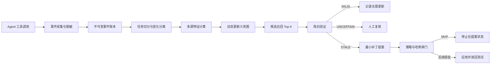
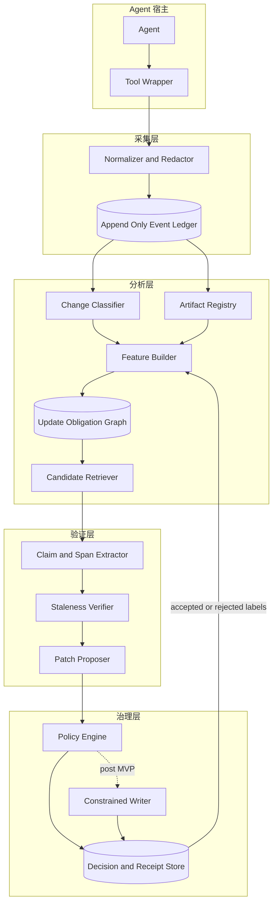
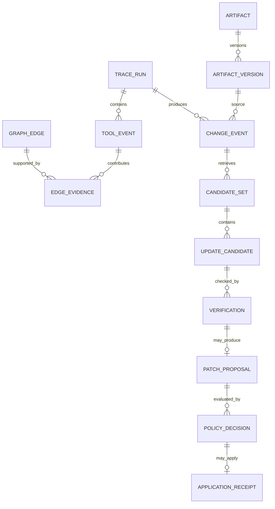

# 轨迹驱动的动态制品更新图 Demo 技术方案与研究规划

版本：v0.1  
状态：方案草案  
更新日期：2026-09-14

## 文档说明

本合订版覆盖总体技术方案、系统架构与数据模型、MVP 与 Demo 实施计划、评测与消融实验、风险与治理、后续研发与论文规划，以及 Demo 运行和验收清单。

核心建议是先实现单仓库、离线回放、只读采集、补丁提案模式的 MVP。Artifact Update Graph 只负责召回可能受影响的制品；独立的 staleness verifier 判断具体陈述是否失效。MVP 不执行真实自动写回，也不把建议指标写成已有结果。

## 文档导航

1. 总体技术方案
2. 系统架构与数据模型
3. MVP 与 Demo 实施计划
4. 评测与消融实验方案
5. 风险与治理
6. 后续研发与论文规划
7. Demo 运行手册与验收清单
8. 参考资料

---

## 轨迹驱动的动态制品更新图总体技术方案

### 摘要

超长程 Agent 会持续接触代码、测试、配置、设计文档、计划、研究记录和运行手册。随着任务推进，真正需要维护的关系常常没有静态引用，且无法靠一个不断扩大的索引文件完整表达。当前做法通常依赖模型在当次上下文中的注意力判断“还应该检查什么”。一旦上下文压缩、任务切换或多个 Agent 并行，这些隐含关系容易丢失。

本方案把 Agent 的工具使用轨迹视为项目依赖关系的在线观测信号。系统将轨迹证据、版本历史、静态依赖、显式引用和语义证据聚合成一个有方向、带类型、随时间更新的 Artifact Update Graph。图回答“某类变化发生后，哪些制品值得检查”；独立验证器回答“源制品的这次差异是否使目标制品中的具体陈述失效”。补丁生成和写回位于后续治理阶段，与图计算保持隔离。

建议先建设一个只读 Demo，验证受影响制品召回、陈旧判断和自强化控制。只有这些环节通过离线评测和人工审查后，才讨论低风险制品的自动应用。

### 问题定义

设项目包含制品集合 \(V\)，制品可以是文件、文件内的稳定片段、数据库模式、测试、配置项、运行手册、计划或外部版本化记录。一次变更为 \(\Delta A\)，其中包含源制品、前后版本、差异、变化类型和任务上下文。

系统要估计的不是无条件相关度 \(Related(A,B)\)，而是：

\[
P(ReviewOrUpdate(B) \mid \Delta A, ChangeType, TaskContext, Evidence)
\]

这一定义包含三个不同问题：

1. 候选召回：变化发生后，哪些制品可能受影响。
2. 陈旧验证：目标制品中是否存在已被当前变化推翻或需要复核的陈述。
3. 变更治理：发现陈旧后，系统可以提出、应用或发布何种修改。

三个问题必须分别评测。候选分数高不能代替陈旧证据，陈旧证据也不能代替写回授权。

### 核心概念

#### Artifact

Artifact 是可以被版本化、引用、检查或修改的工作制品。MVP 以文件为主节点，同时允许记录文件内的 claim span。建议的首批类型包括：

- source code
- test
- configuration
- schema or contract
- design documentation
- runbook
- execution plan
- generated report

#### Tool trace

Tool trace 是 Agent 与环境交互的顺序事件流。它至少记录事件标识、任务标识、顺序号、操作类型、目标制品、前后哈希、结果状态、父事件、时间和访问来源。默认不保存原始密钥、完整提示词或不必要的文件内容。

#### Update obligation

Update obligation 是一个条件化、有方向的审查或更新义务。相同的两个制品在不同变化类型下具有不同边权。例如，函数内部重构对 API 文档的更新义务应很低，而公共接口字段改变时应显著升高。

#### Staleness

Staleness 表示目标制品中的某个可定位陈述与当前权威证据不一致，或其成立条件已经改变。验证器输出 `VALID`、`STALE`、`UNCERTAIN` 或 `NOT_APPLICABLE`，并附上目标片段、证据标识和判定依据。`UNCERTAIN` 必须停止自动流程。

#### Origin

每个访问事件都要标记来源：`organic`、`system_recommended`、`human_directed`、`replay` 或 `unknown`。系统推荐后发生的读取不能与 Agent 自发发现的读取等权训练，否则图会把自己的推荐逐步强化为高置信关系。

### 目标与非目标

| 目标 | 非目标 |
| --- | --- |
| 从真实工具轨迹中学习跨代码和文档的候选更新义务 | 建造一个覆盖所有项目知识的通用知识图谱 |
| 在变化发生时召回需要复核的制品，并提供可解释证据 | 让相关度分数直接控制文件写回 |
| 通过独立验证减少错误更新和无意义检查 | 在 MVP 中使用 GNN 或端到端强化学习 |
| 支持确定性回放、审计、拒绝和回滚 | 宣称 Demo 已证明生产自治安全 |
| 区分自发行为与系统诱导行为 | 将 Agent 行为视为无偏的因果真值 |

### 设计原则

#### 先观测再干预

第一阶段只记录行为并离线重放，不改变 Agent 的工具选择。只有形成基线后，系统才向 Agent 提供候选提示。这样可以分别测量自然轨迹和系统干预后的轨迹。

#### 图提供历史先验

图的作用是缩小搜索空间，并说明候选为何被召回。最终判断仍依赖当前差异、目标内容、权威来源和验证证据。图不能替代当前状态读取。

#### 写回与推断隔离

候选检索、陈旧验证、补丁生成、补丁应用和正式采纳使用不同状态与权限。任一阶段失败都不得把后续状态写成成功。

#### 证据可重放

每次判断记录输入版本、策略版本、特征版本、模型版本、候选列表、证据引用和输出摘要。相同的冻结输入应能生成相同的特征和排序；包含非确定性模型的步骤应记录原始响应摘要和随机性配置。

#### 默认拒绝

缺少目标哈希、来源不明、策略无法解析、验证器不确定或受保护制品命中时，系统停止在只读状态。禁止通过重试绕过治理拒绝。

### 证据信号

MVP 合并以下信号，但保留每类信号的独立贡献，便于消融和解释：

| 信号 | 示例 | 主要局限 |
| --- | --- | --- |
| 有序工具轨迹 | 修改 A 后搜索概念并编辑 B | 会受 Agent 策略和推荐干预影响 |
| 失败链 | 编辑 A 后测试失败，随后修复 B | 需要可靠的父事件和错误归因 |
| Git 共变更 | A 与 B 在历史任务中经常共同提交 | 大型提交会产生大量伪关系 |
| 静态依赖 | import、调用、模式引用 | 难以覆盖文档、计划和组织依赖 |
| 显式引用 | Markdown 链接、路径、符号名 | 引用存在不代表内容已受影响 |
| 语义证据 | 描述同一契约或业务规则 | 相似不等于更新义务 |
| 任务族 | A 与 B 经常出现在同类任务 | 任务分类错误会扩散到边权 |

### 总体流程



#### 生命周期

1. Agent 执行任务，采集器记录工具事件。
2. 任务完成或形成稳定变更点后，系统生成 ChangeEvent。
3. 特征构建器以时间衰减、任务规模归一化和来源校正更新图边。
4. 候选检索器结合变化类型和目标敏感度输出 Top K。
5. 验证器从候选中提取可核验陈述，并只使用冻结证据判断当前状态。
6. 补丁生成器为 `STALE` 陈述产生最小差异及预期旧哈希。
7. 策略引擎决定 `PROPOSE_ONLY`、`REVIEW_REQUIRED` 或后续阶段的 `AUTO_APPLY_ALLOWED`。
8. 写入器在目标哈希仍匹配时应用补丁，随后独立读回并运行约定测试。
9. 人工接受与正式来源更新由独立状态记录。

### Demo 场景

样例仓库包含认证代码、测试、设计文档和配置。Agent 将公共字段从 `user_id` 改为 `subject_id`。静态调用图可以找到直接依赖，却不会自然连接到描述旧字段的设计文档。历史轨迹和显式符号证据使该文档进入候选列表，验证器定位旧陈述并提出一个只替换契约描述的补丁。

同一仓库随后执行负对照：仅重命名函数内部局部变量。相关文件仍可能具有较高历史相关度，但变化影响分数接近零，验证器应返回 `VALID` 或 `NOT_APPLICABLE`，不产生补丁。

第三个场景模拟一次涉及大量文件的机械格式化。系统将任务表示为 hyperedge 或对大任务降权，避免把所有文件两两连接。

### 与已有工作的关系

OpenAI 的 harness engineering 实践把仓库知识组织成版本化的 system of record，并使用检查和周期性 doc gardening 处理陈旧文档。本方案把触发时机前移到实际变化发生时，并尝试从 Agent 行为中学习需要检查的目标。

软件工程研究长期使用 logical coupling、version history mining 和 temporal graph 预测共同变化。文档陈旧检测工作则可通过符号引用发现代码元素已经消失但文档仍保留旧引用。本方案拟研究的增量是把完整工具轨迹、变化类型、跨类型制品、独立陈旧验证和干预偏差控制放入同一条可审计流水线。该增量目前是研究假设，需由第 04 号文档中的对照实验确认。

### MVP 成功条件

以下均为建议门槛：

- 冻结轨迹可确定性重放，事件与特征账本完整率为 100%。
- 在人工标注的 Demo 集上，候选 `Recall@10` 达到 0.80 以上。
- 与不含工具轨迹的最佳基线相比，完整模型的 `Recall@10` 有正向提升，且任务级 bootstrap 置信区间不跨零。
- 负对照中的错误补丁提案率不高于 5%。
- 每个 `STALE` 结论都包含目标片段、源差异、证据标识和冻结版本。
- 系统诱导访问不会按有机访问的权重更新边。
- MVP 演示全程不执行真实自动写回。

这些门槛用于决定是否继续研发，不构成当前结果。

### 建议决定

按四周计划启动单仓库 MVP，先冻结契约和评测，再实现采集、图构建、召回和验证。系统在 `PATCH_PROPOSED` 状态停止。只有候选召回、负对照、自强化防护和证据完整性同时达标，才进入受控沙箱中的低风险写回实验。

---

## 轨迹驱动的动态制品更新图系统架构与数据模型

### 架构决定

MVP 采用本地优先、事件溯源、单仓库、离线回放架构。SQLite 保存不可变事件、制品版本、边证据和决策记录；图计算使用关系表和增量聚合，不引入图数据库。Agent 宿主通过薄适配器输出规范化事件，分析核心不依赖具体模型供应商。陈旧验证器可以调用语言模型，但必须通过窄接口接收冻结证据，且没有写文件工具。

系统默认停止在补丁提案状态。事件采集、推断、验证、补丁生成和写入使用分离的权限与状态表。

### 系统边界

#### 边界内

- 采集 Agent 工具调用的元数据和受控差异摘要
- 建立制品注册表和版本快照
- 从工具轨迹、Git、静态关系、显式引用和语义证据计算边特征
- 生成有方向、带变化类型的候选更新义务
- 对目标制品中的具体陈述执行陈旧验证
- 生成不落盘的最小补丁提案
- 保存审计记录、评测标签和人工决策

#### 边界外

- 代替 Git、文档库或数据库成为正式来源
- 在没有明确策略和新鲜授权时修改受保护制品
- 捕获或长期保存完整提示词、密钥和所有文件正文
- 用图分数推断业务真值或因果关系
- 在 MVP 中自动提交、推送、开 PR 或合并

### 逻辑架构



### 组件职责和失败行为

| 组件 | 输入与输出 | 持久状态 | 失败行为 |
| --- | --- | --- | --- |
| Tool Wrapper | 宿主工具请求与结果 → 原始事件 | 无或短时缓冲 | 不阻断宿主任务；记录采集缺口 |
| Normalizer and Redactor | 原始事件 → 规范事件 | 脱敏规则版本 | 无法判定敏感性时丢弃正文，只保留最小元数据 |
| Event Ledger | 规范事件 → 可重放序列 | SQLite WAL | 写入失败时标记 trace incomplete，不允许训练或自动决策 |
| Artifact Registry | 路径、类型、哈希、版本 | artifact 和 artifact_version | 路径越界或符号链接逃逸时拒绝登记 |
| Change Classifier | 差异和上下文 → 变化类型与影响 | change_event | 不确定时使用 `unknown`，提高复核要求 |
| Feature Builder | 多源证据 → 版本化特征 | edge_evidence 和 feature snapshot | 单一信号失败时降级，但必须记录缺失特征 |
| Update Graph | 特征 → 方向性边与分数 | graph_edge | 版本不一致时不覆盖旧图，生成新快照 |
| Candidate Retriever | 变化事件与图 → Top K 候选 | candidate_set | 无证据时返回空集，不扩大到全仓库写入 |
| Staleness Verifier | 冻结差异、目标片段、权威证据 → 判定 | verification | 超时、冲突或证据不足时返回 `UNCERTAIN` |
| Patch Proposer | `STALE` 证据 → 最小补丁 | patch_proposal | 无法生成局部补丁时仅给出人工说明 |
| Policy Engine | 提案、制品等级、信心、策略 → 动作 | policy_decision | 未知策略值一律拒绝 |
| Constrained Writer | 经批准提案和预期哈希 → 应用结果 | application_receipt | 哈希漂移、测试失败或越界时停止并保留工作副本 |

### 事件生命周期

#### 事件进入

每个宿主适配器在工具调用前生成 `event_id` 和单调递增的 `sequence_no`。工具完成后补充结果状态、目标哈希和摘要。采集器以 `(trace_id, sequence_no)` 作为幂等键；重复事件必须内容一致，否则记录 `IDEMPOTENCY_CONFLICT`。

#### 规范化

规范化器执行以下步骤：

1. 将宿主工具名映射为 `read`、`search`、`edit`、`write`、`delete`、`test`、`execute`、`commit`、`approve` 或 `reject`。
2. 将目标路径解析为仓库根目录内的规范相对路径。
3. 解析符号链接并拒绝越过允许根目录的目标。
4. 计算输入、输出、前版本、后版本和差异的摘要哈希。
5. 按策略删除密钥、令牌、个人信息和超出采集范围的正文。
6. 标记访问来源和推荐标识。

#### 任务切分

MVP 优先使用宿主提供的 task 或 thread 标识。缺少显式标识时，按短时间窗、共同目标和父事件形成 trace segment，但该段标记为 `inferred`，其边证据降权。单次任务触及大量制品时，不生成完整两两边集合，而是保存一个 task hyperedge 和有限的有序邻接证据。

#### 变化形成

当一次 `edit` 或 `write` 产生新哈希，或 Git 快照显示内容变化时，系统创建 ChangeEvent。连续小编辑可以在任务完成时合并为一个净差异，但原始事件仍保留。

#### 候选和验证

候选检索先应用硬规则，再应用图排序。硬规则包括显式模式引用、已知生成关系、测试与被测单元映射等。排序只决定检查顺序。验证器读取当前目标版本，定位陈述，比较冻结证据并输出结构化结论。

### 核心状态机

```text
OBSERVED
  -> NORMALIZED
  -> CHANGE_CLASSIFIED
  -> CANDIDATES_RANKED
  -> VERIFIED_VALID | VERIFIED_STALE | VERIFIED_UNCERTAIN
  -> PATCH_PROPOSED
  -> POLICY_APPROVED | POLICY_REJECTED
  -> APPLIED
  -> READBACK_VERIFIED
  -> TESTED
  -> HUMAN_ACCEPTED
  -> CANONICALIZED
```

允许的主要终止状态为 `TRACE_INCOMPLETE`、`VERIFIED_VALID`、`VERIFIED_UNCERTAIN`、`POLICY_REJECTED`、`HASH_CONFLICT`、`APPLICATION_FAILED` 和 `TEST_FAILED`。状态只能由持有相应权限的组件推进。重新尝试必须创建新的 attempt，不覆盖原 attempt。

### 数据模型



#### TraceRun

| 字段 | 类型 | 约束与含义 |
| --- | --- | --- |
| trace_id | text | 主键，宿主内稳定 |
| task_id | text | 显式或推断任务标识 |
| repository_id | text | 绑定仓库和允许根目录 |
| started_at and ended_at | timestamp | 统一使用 UTC，显示层转换时区 |
| origin_mode | enum | organic、assisted、replay |
| collector_version | text | 采集器版本 |
| completeness | enum | complete、partial、unknown |
| trace_digest | text | 规范事件序列摘要 |

#### ToolEvent

| 字段 | 类型 | 必需 | 含义 |
| --- | --- | --- | --- |
| event_id | text | 是 | 全局唯一事件标识 |
| trace_id | text | 是 | 所属轨迹 |
| sequence_no | integer | 是 | 轨迹内单调递增 |
| parent_event_id | text | 否 | 因果或调用父节点 |
| operation | enum | 是 | 规范化操作类型 |
| artifact_id | text | 否 | 直接目标制品 |
| before_hash and after_hash | text | 条件必需 | 内容变化时必需 |
| diff_digest | text | 否 | 差异摘要，不等同于原文 |
| result_status | enum | 是 | success、failure、cancelled、unknown |
| access_origin | enum | 是 | organic、system_recommended、human_directed、replay、unknown |
| recommendation_id | text | 条件必需 | 推荐访问时必需 |
| payload_policy | text | 是 | 脱敏策略版本 |

完整 JSON Schema 见 `schemas/tool_event.schema.json`。

#### Artifact 和 ArtifactVersion

Artifact 保存身份和治理属性，ArtifactVersion 保存某一时点的不可变内容身份。路径变更不应直接产生新 Artifact；在能够可靠识别 rename 时，通过 alias 表保留连续身份。无法确认 rename 时宁可生成新制品并记录候选关联。

关键字段包括：

- `artifact_id`
- `repository_id`
- `canonical_uri`
- `artifact_kind`
- `authority_class`
- `risk_class`
- `owner_role`
- `write_policy`
- `content_hash`
- `version_ref`
- `observed_at`

`authority_class` 建议使用 `canonical`、`derived`、`working` 和 `external_snapshot`。图和验证记录永远不是业务内容的 canonical source。

#### ChangeEvent

ChangeEvent 绑定源版本、目标版本和净差异，保存：

- `change_type`: refactor、rename、interface、schema、behavior、policy、configuration、documentation、deletion、unknown
- `impact_score`: 0 到 1 的建议影响分数
- `scope`: symbol、file、module、repository
- `classifier_source`: deterministic、model、human
- `classifier_confidence`
- `input_digest`

确定性规则优先识别纯格式化、注释变化、符号 rename、模式差异和公共接口变化。语言模型只补充难以由规则判断的类别；不确定时保留 `unknown`。

#### GraphEdge 和 EdgeEvidence

GraphEdge 是某一图版本下的聚合结论，不删除其原始证据。

| 字段 | 含义 |
| --- | --- |
| source_artifact_id | 发生变化的制品 |
| target_artifact_id | 候选复核制品 |
| change_type | 条件化变化类型 |
| relation_type | trace、cochange、static、reference、semantic、task_family 或 fused |
| direction | source_to_target |
| score | 校准后的候选分数 |
| support_count | 总支持次数 |
| organic_support | 自发访问支持量 |
| recommended_support | 推荐诱导支持量 |
| last_observed_at | 最近证据时间 |
| feature_version | 特征定义版本 |
| graph_version | 图快照版本 |

EdgeEvidence 记录具体工具事件、提交、引用或静态边。任何分数都应能追溯到这些证据。

#### CandidateSet 和 UpdateCandidate

CandidateSet 绑定一个 ChangeEvent、图版本、策略版本和检索参数。UpdateCandidate 保存 rank、各通道特征、最终分数、触发规则和解释。候选集不可原地重排；参数或图变化会生成新集合。

#### Verification

Verification 的输出契约如下：

```json
{
  "verification_id": "ver_...",
  "candidate_id": "cand_...",
  "target_version_hash": "sha256:...",
  "status": "STALE",
  "confidence": 0.97,
  "affected_spans": [
    {
      "locator": "line:42-44",
      "claim": "Authentication context exposes user_id",
      "reason_code": "CONTRACT_FIELD_CHANGED"
    }
  ],
  "evidence_ids": ["chg_...", "evt_..."],
  "verifier_version": "rules+model-v1",
  "abstention_reason": null
}
```

判定规则：

- `VALID`：当前证据支持目标陈述，或变化与陈述无关。
- `STALE`：证据直接推翻陈述或改变其成立条件。
- `UNCERTAIN`：证据冲突、内容含混、来源等级不足或模型信心不足。
- `NOT_APPLICABLE`：目标不包含与该变化相关的可核验陈述。

验证器将仓库内容视为不可信数据。目标文件中的自然语言不得改变验证器策略、工具权限或输出格式。

#### PatchProposal

PatchProposal 必须包含：

- `target_artifact_id`
- `expected_target_hash`
- `verification_id`
- `patch_format`
- `patch_digest`
- `changed_spans`
- `minimality_check`
- `tests_to_run`
- `rollback_material`
- `generator_version`

补丁只能修改被验证为陈旧的最小片段。若需要大范围重写，系统将提案降级为人工任务，不自动生成覆盖式修改。

#### PolicyDecision 和 ApplicationReceipt

PolicyDecision 保存策略版本、制品风险等级、动作、原因码、决策主体和时间。允许动作包括 `PROPOSE_ONLY`、`REVIEW_REQUIRED`、`AUTO_APPLY_ALLOWED` 和 `REJECTED`。MVP 策略只会产生前两种或拒绝。

ApplicationReceipt 记录新 attempt、写前哈希、写后哈希、读回结果、测试结果、工作区路径和回滚方式。它不代表人工接受或 canonicalization。

### 评分模型

MVP 使用可解释的线性或逻辑回归排序，不使用 GNN。对源制品 A、目标制品 B 和变化类型 c，构造：

\[
U(B \mid \Delta A,c)=\sigma(\beta_0 + \sum_i \beta_i f_i)
\]

建议特征包括：

- 有机 trace 共现、方向和时间距离
- `edit → test failure → edit` 因果链强度
- Git 共变更频率、支持度和置信度
- 静态 import、调用和模式依赖
- Markdown、路径、符号和 schema 显式引用
- 语义相似度
- 任务族共参与率
- 变化影响分数
- 目标对该变化类型的敏感度
- 时间衰减
- 大任务惩罚
- 推荐诱导证据占比惩罚

候选排序与陈旧验证分别校准。候选分数不能解释为“需要修改的概率”，除非在独立标注集上完成概率校准并明确标签定义。

### 自强化控制

推荐事件通过 `recommendation_id` 与访问事件关联。在线边更新建议使用：

\[
support = organic + \alpha \cdot human\_directed + \gamma \cdot recommended
\]

其中 \(0 \leq \gamma \ll 1\)，且只有当推荐访问产生独立结果，如发现真实陈旧、补丁被人工接受或测试暴露依赖时，才允许提高该证据权重。消融实验必须包含“未校正推荐访问”组，用于量化反馈回路。

### 大任务和 Hyperedge

当任务触及 N 个制品时，直接生成 \(N(N-1)\) 条边会把批量格式化或生成任务转化为伪依赖。MVP 采用以下控制：

- 对触及制品数超过阈值的任务按 `1/log(1+N)` 降权。
- 只保留有序窗口内、显式因果链内和已有静态关系上的 pair evidence。
- 保存 `task_hyperedge`，供后续模型使用。
- 将 format、generated bulk update 和 vendor sync 标记为特殊任务族。

### API 和命令面

MVP 可以提供一个本地 CLI，名称仅为接口示例：

```text
daug trace ingest <trace.jsonl>
daug artifact scan <repo>
daug graph build --until <timestamp>
daug change classify --diff <diff>
daug candidates rank --change <change_id> --top-k 10
daug verify --candidate-set <id>
daug patch propose --verification <id>
daug replay --trace <trace_id> --graph-version <version>
daug report demo --run <run_id>
```

每条命令输出 JSON 到标准输出，将人类可读报告写入显式指定路径。命令不得根据当前目录推测可写范围。

### 一致性与回放保证

| 场景 | 预期行为 |
| --- | --- |
| 同一事件重复导入 | 内容相同则返回已有记录；内容不同则报幂等冲突 |
| 图构建中断 | 保留未发布快照；旧图继续可读 |
| 策略在验证期间变化 | 当前 attempt 绑定原策略；新策略需新 attempt |
| 目标文件在验证后变化 | 写回前哈希检查失败，返回 `HASH_CONFLICT` |
| 模型调用超时 | 返回 `UNCERTAIN`，不得自动重试到通过 |
| 测试失败 | 保留工作副本和回执，不进入 `TESTED` |
| 同一冻结轨迹回放 | 规范事件、确定性特征和基线排序摘要一致 |

### 存储和索引

SQLite 采用 WAL 模式和显式事务。建议索引：

- `tool_event(trace_id, sequence_no)`
- `tool_event(artifact_id, occurred_at)`
- `artifact_version(artifact_id, observed_at)`
- `edge_evidence(source_artifact_id, target_artifact_id, change_type)`
- `graph_edge(graph_version, source_artifact_id, change_type, score desc)`
- `update_candidate(candidate_set_id, rank)`
- `verification(candidate_id, created_at)`

事件和版本表只追加。聚合表通过新版本发布，不原地覆盖可复现实验所依赖的旧版本。

### 安全和隐私

- 默认只保存路径、类型、哈希、长度、退出状态和受控特征，不保存完整提示词。
- 差异正文只在验证所需的最小窗口内短期存在，持久化前执行 secret scan 和路径策略。
- 仓库根、允许后缀、忽略目录和受保护制品由版本化策略声明。
- 外部链接、Issue、注释和文档文本一律视为不可信数据，不能授予工具权限。
- 生产密钥、访问令牌、个人数据、医疗数据和客户数据不进入 Demo 数据集。
- 导出研究数据时使用仓库和路径的稳定伪标识，并保留许可证与来源清单。

### 待决技术选择

以下决定应在第一周完成，不影响当前文档成立：

1. 首个宿主适配器选 Codex、Pi，还是先只接收通用 JSONL。
2. 文件内 claim span 使用行号、AST 节点还是内容寻址锚点。
3. 语义特征在本地计算还是通过受控远程服务计算。
4. MVP 的语言栈采用全 TypeScript，还是 TypeScript 采集加 Python 评测。
5. 人工标注界面使用静态 HTML 报告还是轻量本地 Web UI。

建议默认选择通用 JSONL 加一个宿主适配器、内容哈希与行号双锚点、TypeScript 核心、Python 离线评测和静态 HTML 报告，以降低首轮实现复杂度。

---

## 轨迹驱动的动态制品更新图 MVP 与 Demo 实施计划

### 实施结论

建议用四周完成一个单仓库、离线回放、只读采集、补丁提案模式的 MVP。第一周冻结范围、状态机、事件契约、标签规则和验收测试；第二周完成账本与制品注册；第三周完成候选召回和陈旧验证；第四周完成消融评测、演示脚本和独立审查。

该计划按一名主要实施者和一名兼职评审者估算。若首个宿主适配器必须同时覆盖 Codex 和 Pi，或需要可视化标注界面，应增加一至两周。

### MVP 范围冻结

#### 必须实现

- 通用 JSONL 轨迹导入器
- 一个真实 Agent 宿主的薄适配器
- SQLite 事件账本和确定性回放
- 文件级制品注册、内容哈希和版本记录
- Git 共变更、显式引用、静态依赖、语义和工具轨迹特征
- 有方向、带变化类型的候选排序
- `VALID`、`STALE`、`UNCERTAIN`、`NOT_APPLICABLE` 陈旧验证契约
- 最小补丁提案、目标哈希和证据包
- 只读 HTML 或 Markdown 运行报告
- 正例、负例和大任务压力场景
- 候选召回、验证质量、成本和自强化消融

#### 明确不实现

- 自动修改真实仓库
- 自动 commit、push、开 PR 或 merge
- 跨组织、跨租户图合并
- 在线 GNN、强化学习或端到端训练
- 通用自然语言知识图谱
- 对 PDF、二进制或非版本化 SaaS 文档做直接写回
- 把模型判定作为正式业务或科研结论

### 建议技术栈

| 层 | MVP 选择 | 理由 |
| --- | --- | --- |
| 宿主适配 | TypeScript | 便于包装常见 Agent 工具事件 |
| 核心 CLI | TypeScript | 与适配层共享契约，减少跨语言状态漂移 |
| 持久化 | SQLite WAL | 单机可审计、易迁移、适合确定性回放 |
| 图表示 | SQLite adjacency tables | 避免过早引入图数据库 |
| 静态分析 | Git、路径引用、轻量符号提取 | 先覆盖 Demo 的可解释基线 |
| 语义特征 | 可替换 embedding adapter | 不绑定特定供应商 |
| 陈旧验证 | 规则优先加受限模型适配器 | 确定性规则覆盖明确契约，模型处理语义陈述 |
| 离线评测 | Python 脚本 | 便于统计、bootstrap 和制图 |
| 人类报告 | 静态 HTML 加 JSON | 无需运行长期服务，便于归档 |

所有外部依赖应锁定版本并记录许可证。MVP 不需要消息队列、向量数据库或分布式服务。

### 先冻结的契约和测试

开发开始前应合并以下规范文件：

1. `tool_event.schema.json`
2. SQLite DDL 和迁移编号
3. ChangeType 枚举与判定优先级
4. Verification 输出模式
5. 状态转换表
6. risk class 与 write policy 矩阵
7. 评测标签手册
8. Demo fixture 的黄金结果

#### 核心契约测试

| 测试编号 | 场景 | 预期结果 |
| --- | --- | --- |
| C01 | 同一事件重复导入 | 返回同一记录，不增加行数 |
| C02 | 相同 event_id 但内容不同 | `IDEMPOTENCY_CONFLICT` |
| C03 | 目标路径越过仓库根 | 拒绝并记录原因 |
| C04 | 编辑事件缺少前后哈希 | 标记 trace incomplete，不进入训练 |
| C05 | 推荐访问缺少 recommendation_id | 验证失败 |
| C06 | 相同冻结输入重复构图 | 图摘要一致 |
| C07 | 目标哈希在验证后改变 | `HASH_CONFLICT` |
| C08 | 验证器证据不足 | `UNCERTAIN`，不产生可应用动作 |
| C09 | 受保护制品被判定陈旧 | 允许提案或人工说明，拒绝自动应用 |
| C10 | 大型格式化任务 | 不生成完整两两边集合 |
| C11 | 系统推荐后发生读取 | 不按 organic 权重更新边 |
| C12 | 测试失败 | attempt 停止在 `TEST_FAILED` |

#### Demo 行为测试

| 测试编号 | 场景 | 预期结果 |
| --- | --- | --- |
| D01 | 公共字段 `user_id` 改为 `subject_id` | 设计文档进入 Top 10，并被定位为 `STALE` |
| D02 | 同一模块只改局部变量 | 设计文档不产生补丁提案 |
| D03 | 删除公开配置键 | 配置参考和迁移手册进入候选 |
| D04 | 只修改文档措辞 | 不反向要求无关代码更新 |
| D05 | 500 文件格式化 | pair evidence 受控，任务保存为 hyperedge |
| D06 | 目标文档含提示注入文本 | 验证器仍只输出固定模式，无额外工具行为 |

### 样例仓库设计

```text
demo-repo/
├── src/auth/user_context.ts
├── src/auth/auth_filter.ts
├── tests/auth_filter.test.ts
├── config/auth_policy.yaml
├── docs/auth_design.md
├── docs/api_contract.md
├── docs/rollout_plan.md
└── fixtures/tasks/
```

#### 场景 A 接口变化

`UserContext` 的公共字段由 `user_id` 改为 `subject_id`。测试、过滤器和 API 契约具有直接或静态关系，`auth_design.md` 只在自然语言中描述旧字段。预期系统结合历史轨迹和语义证据召回该文档，并提出局部替换。

#### 场景 B 负对照

只重命名 `auth_filter.ts` 中的局部变量，不改变行为、接口或配置。预期变化分类为 `refactor`，相关文档返回 `VALID` 或 `NOT_APPLICABLE`。

#### 场景 C 大任务

对 500 个文件执行格式化。预期系统将任务标记为 bulk format，以 hyperedge 和有限邻接证据表示，不产生 124750 条无差别 pair 边。

#### 场景 D 自强化

系统先推荐读取一个与变化无关的文档，Agent 随后读取但没有发现陈旧。预期该访问仅计为低权重推荐证据；下一轮该文档的分数不得因单次推荐显著上升。

### 四周实施计划

#### 第零阶段 范围与基线冻结

时间：第 1 天至第 2 天

工作：

- 确认首个宿主适配器和允许根目录
- 冻结术语、状态机和不做事项
- 创建 Demo 仓库与四类场景
- 标注第一版黄金候选和陈旧片段
- 固化纯路径、纯语义、Git 共变更和静态依赖基线

交付：规范清单、黄金 fixture、基线运行清单。

退出条件：需求和标签由实施者之外的评审者读回确认；任何关于自动写回的代码均不进入范围。

#### 第一阶段 事件账本和回放

时间：第 3 天至第 7 天

工作：

- 实现 JSONL 导入、schema 校验和脱敏
- 实现 TraceRun、ToolEvent、Artifact、ArtifactVersion
- 实现事件幂等、完整性标记和 trace digest
- 实现路径归一化、符号链接边界和忽略规则
- 实现确定性回放与账本导出
- 接入一个宿主适配器，仅采集允许事件

交付：`trace ingest`、`artifact scan`、SQLite 数据库、契约测试报告。

退出条件：C01 至 C05 全部通过；冻结轨迹的事件摘要重复运行一致；敏感字段测试未发现原文泄漏。

#### 第二阶段 图特征和候选召回

时间：第 8 天至第 13 天

工作：

- 实现 ChangeEvent 和规则优先的变化分类
- 提取 Git 共变更、显式引用和轻量静态依赖
- 从工具顺序、时间距离和失败链提取 trace 特征
- 实现 task size normalization、时间衰减和 origin correction
- 构建版本化 GraphEdge 与 EdgeEvidence
- 实现硬规则加线性排序的 Top K 召回

交付：`graph build`、`candidates rank`、候选解释报告。

退出条件：C06、C10、C11 通过；D01 的目标文档进入 Top 10；D02 不因高历史相关度被直接判定需更新。

#### 第三阶段 陈旧验证和补丁提案

时间：第 14 天至第 19 天

工作：

- 实现 claim span 提取和冻结证据包
- 先实现 rename、schema、显式引用和配置键的确定性验证器
- 接入无写权限的模型验证器处理语义陈述
- 实现四值判定、置信度和 abstention reason
- 实现目标哈希绑定、局部补丁和 minimality check
- 实现 Markdown 或 HTML 评审报告

交付：`verify`、`patch propose`、证据包和补丁预览。

退出条件：C07 至 C09、C12 和 D06 通过；所有 `STALE` 都能回溯到具体差异与片段；系统没有写文件路径。

#### 第四阶段 评测与演示

时间：第 20 天至第 25 天

工作：

- 运行候选基线与完整模型消融
- 运行正例、负例、大任务和自强化场景
- 计算 Recall@K、MRR、验证 F1、选择性准确率、成本和延迟
- 对错误样本执行双人复核或仲裁
- 固化演示命令、截图和运行摘要
- 由未参与实现的人执行只读复现

交付：评测报告、Demo 运行包、复现清单、风险审查结果。

退出条件：建议门槛达到，或形成明确的停止原因和下一轮实验设计。低于门槛时不通过调整标签或删除负样本掩盖失败。

### 工作分解

| 工作包 | 主要产物 | 依赖 | 建议负责人角色 |
| --- | --- | --- | --- |
| WP1 契约与治理 | schema、状态机、策略 | 无 | 技术负责人加安全评审 |
| WP2 采集与账本 | adapter、ledger、replay | WP1 | 平台工程 |
| WP3 制品与图 | registry、features、ranking | WP1、WP2 | 后端或研究工程 |
| WP4 验证与补丁 | verifier、evidence、proposal | WP1、WP3 | Agent 工程 |
| WP5 评测 | dataset、labels、ablation | WP1、WP3、WP4 | 研究工程 |
| WP6 Demo 与复现 | fixture、runbook、report | 全部 | 独立评审者 |

### 每日开发节奏

1. 先增加一个失败的契约或行为测试。
2. 实现最小改动使该测试通过。
3. 运行受影响测试和确定性回放。
4. 检查数据库迁移、事件摘要和证据链。
5. 将未决问题写入决策日志，不通过提示词隐式改变契约。

功能完成、测试通过和真实交互验证分别记录。宿主适配器的单元测试通过不能替代真实 Agent 会话中的采集验证。

### 里程碑和退出门槛

| 里程碑 | 交付 | 建议退出门槛 |
| --- | --- | --- |
| M1 可重放账本 | 事件导入、注册、哈希、回放 | 契约测试全过，事件摘要稳定 |
| M2 可解释召回 | 多源特征、图、Top K | Recall@10 达到建议阈值，解释可追溯 |
| M3 陈旧验证 | 四值判定、证据、补丁提案 | 负对照错误提案率不高于建议阈值 |
| M4 可复现 Demo | 消融报告、运行手册 | 独立机器或干净目录可重放 |
| M5 写回研究准入 | 仅为后续阶段决策 | 人工明确批准新的范围和风险策略 |

### 资源与成本控制

- 所有模型调用记录 token、延迟、缓存状态和模型版本。
- 候选验证按 Top K 和预算停止，默认先运行确定性检查器。
- 语义 embedding 可离线缓存并绑定内容哈希。
- 大型仓库首次扫描与增量扫描分开计时。
- 评测报告同时给出质量和单位任务成本，防止仅通过增加模型调用提高指标。

### 完成定义

MVP 只有在以下条件同时满足时才称为完成：

- 代码和 schema 已实现并通过列出的测试。
- Demo 场景在干净环境中完成离线回放。
- 每项指标都能追溯到冻结数据集和运行配置。
- 负结果、缺失事件和人工分歧均保留在报告中。
- 真实 Agent 宿主采集已交互验证，若未验证则明确标记为 pending。
- 系统没有自动写回、外部发布或 canonicalization 能力。
- 评审者已确认文档、实现和实际行为之间没有状态升级。

---

## 轨迹驱动的动态制品更新图评测与消融实验方案

### 评测目标

评测要回答四个独立问题：工具轨迹是否提高受影响制品的召回，变化类型和方向是否提高排序质量，独立陈旧验证是否减少错误补丁，以及访问来源校正是否抑制自强化。MVP 不用端到端成功率替代这些分层指标。

所有结果按 `Proposed`、`Executed` 和 `Reviewed` 分开记录。本文件给出实验设计和建议阈值，不包含已执行结果。

### 研究问题

#### RQ1 工具轨迹的增量价值

在静态依赖、显式引用、Git 共变更和语义特征已经可用时，加入 Agent 工具轨迹能否提高真实目标制品的 Recall@K 和 MRR？

#### RQ2 类型和方向的作用

将边建模为 `A --change_type--> B`，是否优于无方向、无变化类型的相关图？

#### RQ3 陈旧验证的安全收益

在相同候选集合上，独立 verifier 是否能降低负对照中的错误补丁提案率，同时保留大部分真正陈旧样本？

#### RQ4 自强化偏差

系统推荐导致的访问若按有机访问训练，会以多快速度抬高无关边？origin correction、独立结果确认和冻结基线能否限制该偏差？

#### RQ5 跨类型制品

工具轨迹对没有静态连接的 code-to-doc、code-to-plan、schema-to-runbook 关系是否比传统方法更有效？

#### RQ6 成本和时效

在固定 token 和延迟预算下，规则优先、Top K 截断和选择性验证能否维持可接受的召回和错误率？

### 可证伪假设

| 编号 | 假设 | 反证条件示例 |
| --- | --- | --- |
| H1 | 工具轨迹为候选召回提供独立增益 | 完整模型相对最佳非轨迹基线的任务级差异不为正 |
| H2 | 有方向和变化类型的边提高排序 | 去除方向或类型后指标无实质下降 |
| H3 | verifier 明显减少错误提案 | 错误提案率下降不足，或召回损失过大 |
| H4 | origin correction 抑制自强化 | 无关推荐边仍在多轮中单调快速上升 |
| H5 | 改进主要出现在跨类型、非静态关系 | 增益只来自已有 import 或路径引用 |

### 评测单元和标签

#### 评测单元

一个样本为 `(task, source change, candidate artifact)`。排序指标以 `(task, source change)` 为查询单元，候选文件为文档集合。陈旧指标以候选文件内的 claim span 为单元。补丁指标以一个 Verification 产生的 PatchProposal 为单元。

#### 目标标签

| 标签 | 定义 | 可否用于自动动作 |
| --- | --- | --- |
| MUST_UPDATE | 当前权威证据直接使目标陈述错误、破坏契约或遗漏必要同步 | MVP 不允许自动动作 |
| SHOULD_REVIEW | 变化可能改变含义或完整性，需要领域判断 | 仅人工复核 |
| NO_UPDATE | 当前变化不影响目标内容 | 不生成补丁 |
| UNKNOWN | 证据不足、来源冲突或标注者不能判断 | 排除自动动作，保留在覆盖率统计 |

`MUST_UPDATE` 与 `SHOULD_REVIEW` 不应为了提高二分类分数被随意合并。主排序实验可同时报告严格相关集和宽松相关集：严格集只含 `MUST_UPDATE`，宽松集包含前两类。

#### 标注材料

每个标注包只包含冻结的源差异、目标版本、必要上下文、测试结果和权威来源。标注者不能看到模型分数或候选来源，以减少锚定偏差。

#### 标注流程

1. 两名标注者独立给出四类标签和受影响片段。
2. 分歧样本由第三人仲裁，或保留为 `UNKNOWN`。
3. 报告 Cohen kappa 或 Krippendorff alpha，并单独报告各类分歧率。
4. 修改标签手册后，必须重新标注受影响样本并生成新数据集版本。

### 数据集组成

#### 数据集 A 可控突变基准

从小型样例仓库生成可验证变化：公开符号 rename、schema 字段变更、配置键删除、返回值语义变化、文档引用失效和纯重构。突变器记录注入点和应更新片段，提供高精度 ground truth。

优点是标签清晰、可重复；局限是分布与真实项目不同。结果必须标为 synthetic，不代表真实仓库表现。

建议 MVP 规模：120 个任务，其中正例、负例、跨类型关系和压力场景均有覆盖。该数字是执行目标，可在预实验后调整并记录原因。

#### 数据集 B 历史提交回放

选择有代码、测试和仓库文档的开源项目，按提交时间重放。对每个任务，只使用该时点之前的历史构图；当前提交中共同变化的文件作为候选标签来源，再由人工判断共同变化是否确属更新义务。

历史共变更只能作为弱标签。机械格式化、依赖锁文件、生成文件、批量 vendor 更新和合并提交应单独标记或排除。

建议论文级规模：不少于 10 个项目和 1000 个可用变更任务。MVP 可以先用 2 至 3 个项目验证管线，不对外推性作结论。

#### 数据集 C 真实 Agent 轨迹

让 Agent 在冻结的任务集上工作，记录两种条件：

- organic：系统不提供候选提示。
- assisted：系统提供候选及理由，但不执行写回。

同一任务避免在同一 Agent 实例上连续执行，以减少记忆污染。任务顺序随机化，模型、工具预算、系统提示和仓库版本固定。

#### 数据集 D 自强化压力集

构造一批已知无关制品，系统在多轮中以不同频率推荐读取。比较 naive learning、origin down-weighting、outcome-gated learning 和完全冻结图四种策略下的无关边增长。

### 数据划分和泄漏控制

- 按时间切分训练、验证和测试，禁止使用未来提交构图。
- 论文主结果采用 leave-one-repository-out 或 repository-level holdout。
- 同一 rename、模板复制或近重复文档不得跨集合。
- embedding、任务分类器和规则词典必须绑定其构建时间和版本。
- 若从当前提交共同变化文件生成标签，检索时必须隐藏该提交结果。
- 人工标注者可以看证据，但模型不能读取测试集标签或未来修复。
- 推荐访问产生的轨迹单独标记，不能混入 organic 训练集。
- 调参只使用验证集；测试集仅在方案冻结后运行。

### 对照组

#### 基础基线

| 代号 | 方法 | 用途 |
| --- | --- | --- |
| B0 | Random | 检查任务难度和候选池规模 |
| B1 | Path proximity | 同目录、父目录和文件名相似度 |
| B2 | Semantic only | 文件或片段 embedding 相似度 |
| B3 | Static and explicit | import、call、schema 和文本引用 |
| B4 | Git co-change | 历史关联规则或条件频率 |
| B5 | Static plus Git plus semantic | 不含工具轨迹的强基线 |

#### 轨迹和完整模型

| 代号 | 方法 | 检验点 |
| --- | --- | --- |
| T1 | Organic tool trace only | 轨迹本身的预测力 |
| T2 | Tool trace without order | 有序关系的贡献 |
| T3 | Tool trace without failure chains | 测试失败链的贡献 |
| F0 | Fused without change type | 变化类型的贡献 |
| F1 | Fused without direction | 方向的贡献 |
| F2 | Fused without task-size normalization | 大任务惩罚的贡献 |
| F3 | Fused with naive recommended access | 自强化风险 |
| F4 | Full fused model | 完整方案 |

#### 验证和写回消融

| 代号 | 流程 | 目的 |
| --- | --- | --- |
| V0 | candidate score directly proposes patch | 测量省略 verifier 的风险 |
| V1 | deterministic verifier only | 明确 rename、引用和 schema 场景 |
| V2 | model verifier only | 测量规则缺失时的质量与成本 |
| V3 | deterministic first plus selective model | 完整方案 |
| V4 | V3 without abstention | 测量强制二分类的错误率 |

### 指标

#### 候选召回

- Recall@1、Recall@5、Recall@10
- Precision@K
- Mean Reciprocal Rank
- nDCG@K
- 每个查询的候选覆盖率
- 严格标签和宽松标签分别统计
- code-to-code、code-to-doc、schema-to-runbook 等关系分层统计

主指标建议设为严格 `Recall@10`，因为候选阶段的主要风险是漏掉应检查制品。Precision 和验证成本用于约束无限扩大候选集。

#### 陈旧验证

- 各类别 precision、recall 和 macro F1
- `STALE` precision
- `UNKNOWN` 或 abstention 覆盖率
- selective accuracy versus coverage 曲线
- Brier score 和 Expected Calibration Error
- claim span 定位的 intersection over union 或 exact match

#### 补丁质量

- 人工接受率
- 错误补丁提案率
- 补丁最小性，即变更行数与必要行数之比
- 测试通过率
- 哈希冲突率
- 因目标变化而正确停止的比例

人工接受不等于正式采纳。被接受的补丁仍需经过真实仓库的正常审查流程。

#### 运行指标

- 事件丢失率和 trace completeness
- 重放摘要一致率
- 每次 change 的 p50 和 p95 延迟
- 每次 change 的 token、模型调用和货币成本
- SQLite 大小和增量构图时间
- 每种失败状态的数量

#### 自强化指标

- 无关边在 N 轮后的分数增幅
- organic 和 recommended support 的比例
- 推荐集中度和候选多样性
- 被推荐但无独立结果确认的边保留率
- 干预前后错误候选的持续时间

### 建议验收阈值

以下阈值只用于 MVP go or no-go：

| 指标 | 建议阈值 |
| --- | --- |
| 冻结事件回放一致率 | 100% |
| Demo 人工标注集 Recall@10 | 不低于 0.80 |
| 完整模型相对最佳非轨迹基线的 Recall@10 差异 | 正值且任务级 95% bootstrap 区间不跨零 |
| `STALE` precision | 不低于 0.90 |
| 负对照错误补丁提案率 | 不高于 0.05 |
| 证据字段完整率 | 100% |
| 未校正推荐边相对完整方案的错误增长 | 完整方案应显著更低 |

小样本下不应只用 p 值作决定。必须同时报告绝对差异、置信区间、任务数和错误样本。

### 实验执行流程

1. 冻结数据集清单、样本哈希、标签手册和代码版本。
2. 生成 RunManifest，记录模型、参数、图版本、特征版本、随机种子和预算。
3. 从时间切分点构建基线图，禁止读取未来信息。
4. 对每个查询运行全部基线和消融，保存完整候选列表。
5. 在同一候选集合上运行 verifier 变体。
6. 保存不可变 attempt；失败重试使用新 attempt_id。
7. 由独立脚本重新计算主要指标和摘要哈希。
8. 对 false negative、false positive、abstention 和高成本样本做错误分析。
9. 由未参与实现的人核对数据泄漏、标签和主表。
10. 输出结果时区分 synthetic、historical replay 和 real trace。

### 统计分析

- 以 task 为重采样单元执行 paired bootstrap，避免将同一任务下的多个候选视为独立样本。
- 跨仓库比较时同时给出每仓库结果和 macro average。
- 排序指标使用成对差异和 95% 置信区间。
- 分类指标报告混淆矩阵、每类样本数和置信区间。
- 多次模型调用至少运行三个固定随机种子或温度零复现，并报告方差。
- 预先指定一个主指标和一个主对照，其他结果标为探索性分析。

### 错误分类

| 类型 | 说明 | 优先排查层 |
| --- | --- | --- |
| FN retrieval | 正确目标未进入 Top K | 事件、边特征、图和候选池 |
| FP retrieval | 无关目标排名过高 | 大任务、语义相似、自强化 |
| FN verification | 陈旧陈述被判定为有效或不适用 | 证据包、claim 提取、模型 |
| FP verification | 有效陈述被判定为陈旧 | 权威来源、上下文、变化类型 |
| Patch overreach | 补丁超出验证片段 | 生成器和最小性检查 |
| State upgrade | 提案被误报为已应用或接受 | 状态机、报告层 |
| Provenance gap | 结论无法追溯输入版本 | 账本和 manifest |

### 结果报告模板

每个实验报告至少包含：

- 研究问题和预注册假设
- 数据集版本、时间范围、项目和样本数
- 包含与排除标准
- 标签分布和一致性
- 方法、参数、候选池和预算
- 主结果、置信区间和效应量
- 分层结果和成本
- 失败、重试和缺失数据
- 完整错误样本清单
- 结论适用范围
- 哪些状态仍是 Proposed 或 Pending

### Go or no-go 决策

进入低风险沙箱写回研究必须同时满足：

- H1 或 H5 至少有一个得到清晰支持，且增益不是数据泄漏造成。
- verifier 达到建议 `STALE` precision 和负对照门槛。
- 自强化实验显示完整策略明显优于 naive learning。
- 事件、证据和状态记录可以独立重放。
- 安全评审同意新的明确范围。

若工具轨迹没有增量价值，应停止建设在线图，将成果收缩为可审计的多源变更影响分析。若 verifier 无法达到精度门槛，应保留候选检查助手，不进入补丁自动化。

---

## 轨迹驱动的动态制品更新图风险与治理方案

### 治理结论

MVP 只观察、排序、验证和提出补丁，不自动写回。系统必须把“发现相关”“验证陈旧”“生成补丁”“应用成功”“测试通过”“人工接受”和“正式采纳”记录为不同状态。任何不确定、策略解析失败、证据缺失或目标版本漂移都应停止流程。

自动文件更新会把一个检索问题转化为可能改变项目正式记录的控制问题。治理层因此独立于模型和图，使用版本化策略、内容哈希、窄权限、不可变回执和人工闸门约束动作。

### 权威和状态边界

#### 权威等级

| 等级 | 示例 | 图和验证器的权限 |
| --- | --- | --- |
| Canonical | 已合并代码、正式 schema、批准的政策 | 可读取和引用；不能自行宣布新版本为 canonical |
| Derived | 自动生成文档、索引、报告 | 可提出重建；是否写回由策略决定 |
| Working | 草稿、工作计划、临时分析 | 可在明确工作区内提出局部修改 |
| External snapshot | 外部文档或仓库快照 | 只读；需重新采集才能更新 |

图分数、模型输出、测试结果和运行报告均是证据或派生记录，不是业务内容的正式来源。

#### 双轴状态

一个结果至少有机器状态和人工状态两个轴：

```text
machine_state:
  OBSERVED | RANKED | VERIFIED | PROPOSED | APPLIED | TESTED | FAILED

human_state:
  NOT_REVIEWED | NEEDS_REVIEW | ACCEPTED | REJECTED

authority_state:
  WORKING | MERGED | CANONICAL
```

例如 `machine_state=TESTED` 不能推导出 `human_state=ACCEPTED`，`human_state=ACCEPTED` 也不能推导出已经合并或成为正式来源。

#### STALE 的含义

`STALE` 表示冻结证据与目标陈述不一致，需要处理。它不是“整个文件错误”，也不自动授权删除、改写或发布。验证记录必须定位到具体片段，并允许人工确认目标仍因兼容性、历史说明或其他上下文而有效。

### 自治等级

| 等级 | 能力 | 允许范围 |
| --- | --- | --- |
| L0 Observe | 记录和离线构图 | MVP 默认 |
| L1 Recommend | 向 Agent 提示候选文件和原因 | 受控实验 |
| L2 Propose | 验证陈旧并生成补丁预览 | MVP 上限 |
| L3 Apply in sandbox | 在隔离工作副本应用低风险补丁并测试 | 需新审批 |
| L4 Open review | 创建审查请求或 PR | 需仓库级政策和人类评审 |
| L5 Merge or publish | 合并或发布 | 本方案不建议默认开放 |

升级自治等级必须形成新的范围、策略、威胁模型和验收记录。MVP 的完成不自动授权 L3。

### 制品风险分类

| 风险等级 | 制品示例 | MVP 动作 | 后续自动应用可能性 |
| --- | --- | --- | --- |
| R0 可再生 | 由 schema 确定生成的索引、缓存文档 | 提案或验证重建 | 可在可重建、可回滚条件下研究 |
| R1 低风险说明 | 内部链接、符号名参考、非规范示例 | 补丁提案 | 可能在沙箱与测试后允许 |
| R2 常规工程 | README、设计文档、测试、代码注释 | 人工审查 | 默认要求 PR 评审 |
| R3 运行敏感 | 部署配置、权限、告警、迁移和 runbook | 人工审查 | 禁止无人值守写回 |
| R4 受保护 | 安全策略、法律合规、财务、临床或科研结论 | 只读证据和人工任务 | 禁止自动应用 |

风险等级由版本化策略和显式路径规则确定。未知类型默认为更高风险。

### 风险登记表

| 风险 | 影响 | 早期信号 | 主要控制 | 剩余风险 |
| --- | --- | --- | --- | --- |
| 自强化反馈 | 无关边逐步变成高分 | recommended support 占比上升 | origin 字段、低权重、独立结果门槛、冻结对照 | Agent 策略本身仍有偏差 |
| 相关误当因果 | 误更新相关但未失效的文件 | 高候选分、低验证证据 | 独立 verifier、四值判定、负对照 | 语义陈述仍需人工判断 |
| 大任务边爆炸 | 图被格式化或生成任务污染 | 单任务触及文件数异常 | task normalization、hyperedge、任务族过滤 | 阈值可能不适合所有仓库 |
| 轨迹不完整 | 漏掉关系或错误归因 | sequence 缺口、采集器失败 | completeness 状态、禁止不完整轨迹训练 | 宿主可能不暴露全部事件 |
| 提示注入 | 文档内容试图改变验证器行为 | 模式外输出、额外工具请求 | 数据与指令隔离、固定 schema、无写工具 | 模型仍可能被语义诱导 |
| 敏感信息泄漏 | 日志保存密钥或个人数据 | secret scan 命中 | 最小采集、脱敏、保留期、访问控制 | 哈希和路径也可能泄露结构 |
| 目标版本漂移 | 补丁覆盖他人新修改 | expected hash 不匹配 | 乐观并发控制、停止并重验 | 人工处理冲突仍有成本 |
| 补丁越界 | 修改超出陈旧片段 | changed spans 过大 | minimality check、允许路径和行范围 | 自然语言重写边界有歧义 |
| 错误状态升级 | 测试通过被报告成已接受 | 报告字段不一致 | 双轴状态、类型约束、独立读回 | 人工传播时仍可能简化 |
| 证据投毒 | 伪造轨迹或恶意提交抬高边权 | 异常来源、签名失败 | 来源认证、账本摘要、仓库身份绑定 | 内部可信主体也可能误操作 |
| 模型漂移 | 相同输入在升级后判定变化 | 校准和回放差异 | 模型版本固定、shadow eval、新版本新快照 | 旧模型可能不可长期调用 |
| 成本扩张 | 候选过多导致模型调用失控 | token 和 p95 延迟上升 | Top K、预算、规则优先、缓存 | 长文档验证仍可能昂贵 |
| 标签偏差 | 评测迎合系统设计 | 低一致性、争议样本被删除 | 盲标、仲裁、保留 UNKNOWN | 领域知识仍限制标签质量 |
| 许可证与数据治理 | 研究数据不可发布 | 来源条款不明确 | 数据清单、许可核查、匿名导出 | 某些真实轨迹不能公开 |

### 自强化治理

自强化是本系统的首要方法学风险。图推荐读取 B，Agent 因推荐读取 B，采集器又把该读取当作 A 与 B 的新证据，会形成闭环。

控制要求：

1. 每次推荐生成不可复用的 `recommendation_id`。
2. 后续访问必须声明是否由该推荐触发。
3. recommended access 默认只计低权重证据。
4. 只有独立结果才能提升权重，如测试失败定位到 B、人工确认 B 陈旧、补丁被接受。
5. 原始 organic 基线永久保留，不能被 assisted 轨迹覆盖。
6. 每次模型或策略升级都运行自强化压力集。
7. 报告显示 organic、human-directed 和 recommended support 的分解值。

系统不得通过把 `unknown` 访问改标为 `organic` 来提高分数。

### 写回治理

#### 补丁前置条件

进入任何写入步骤前必须同时满足：

- Verification 为 `STALE`，且没有未解决的冲突证据。
- 目标制品风险等级允许当前动作。
- PolicyDecision 明确允许，reason code 可解析。
- 目标实际哈希等于 PatchProposal 的 expected hash。
- 修改路径位于已确认的允许根目录。
- 补丁仅触及列出的片段和文件。
- 回滚材料已生成。
- 当前 attempt 使用新的单次授权或审批引用。

任一条件缺失都返回稳定拒绝原因。系统不尝试放宽策略或自动重试绕过拒绝。

#### 受保护变更流程

对 R3 或 R4 制品，若未来允许辅助写回，应采用：

```text
精确差异
  -> 用户确认具体目标和内容
  -> 单次审批或认证
  -> 应用完全相同的差异
  -> 独立读回
  -> 约定测试
  -> 人工接受
```

确认后若差异、目标哈希或策略发生变化，原审批失效。审批引用不得复用到新 attempt。

#### 回滚

应用前保存目标旧哈希和可恢复副本。测试失败时不自动覆盖用户后续工作，而是在隔离工作副本中保留失败状态。回滚同样需要比较当前哈希，避免恢复动作覆盖新修改。

### 提示注入和不可信内容

仓库文档、代码注释、Issue、聊天记录、网页和工具输出都可能包含指令式文本。验证器必须把这些内容放入数据字段，不能拼接到高优先级策略文本中。

最低控制：

- 固定系统策略和 JSON 输出模式。
- 验证器不拥有 shell、写文件、网络或审批工具。
- 只提供完成判断所需的最小片段。
- 对“忽略规则”“调用工具”“泄露提示”等模式执行检测并记录。
- 模式外输出直接判为 `UNCERTAIN`。
- PatchProposer 只能接收结构化 Verification，不直接接收未筛选的远程内容。

### 隐私和数据最小化

#### 默认保存

- 规范相对路径或伪标识
- 文件类型和制品类型
- 内容和差异摘要哈希
- 操作类型、时间、顺序和结果状态
- 受控的数值特征
- 模型与策略版本

#### 默认不保存

- 密钥、令牌、Cookie 和凭证
- 完整提示词和完整模型思维内容
- 与验证无关的文件全文
- 用户个人信息、客户数据和医疗数据
- 环境变量原值
- 未经许可的外部文档正文

数据保留期限、访问者、导出目的和删除流程必须写入部署策略。研究导出使用内容不可逆摘要和稳定伪标识，但应承认路径结构与提交时间仍可能重新识别项目。

### 供应链和模型治理

- 锁定依赖版本并生成 SBOM 或等价清单。
- 记录模型供应商、模型标识、日期、参数和区域。
- 新模型先在冻结集 shadow 运行，不直接替换现有 verifier。
- 对 embedding 和模型响应建立内容哈希缓存，缓存命中仍记录模型版本。
- 外部服务不可用时返回降级状态，不以旧结果冒充当前验证。
- 任何第三方上传都需经过许可证、敏感性和保留政策检查。

### 审计证据

每个端到端 attempt 至少保存：

1. TraceRun 和完整性状态
2. ChangeEvent 和源前后哈希
3. graph version 和候选列表
4. 每条候选的 feature breakdown 和 EdgeEvidence
5. Verification 输入摘要、输出、模型和证据标识
6. PatchProposal、目标哈希和最小性检查
7. PolicyDecision 与稳定 reason code
8. 若发生写入，则保存 ApplicationReceipt、读回和测试结果
9. 人工接受或拒绝记录
10. authority state 的最终变化主体

日志中的自然语言说明不能替代这些结构化记录。

### 监控和告警

| 信号 | 建议告警条件 | 处置 |
| --- | --- | --- |
| trace incomplete rate | 连续窗口超过阈值 | 停止在线学习，排查适配器 |
| recommended support ratio | 显著高于 organic | 冻结边更新，运行自强化审计 |
| `UNCERTAIN` rate | 模型或规则升级后突升 | 回退版本，检查证据包 |
| hash conflict rate | 持续上升 | 缩短验证到应用时间或保持提案模式 |
| protected artifact proposals | 任一自动应用尝试 | 立即阻断并审计策略 |
| replay digest mismatch | 任一冻结运行不一致 | 停止发布图版本 |
| evidence completeness | 低于 100% | 不允许报告成功或自动动作 |

### 事件响应

发生错误写入、敏感数据落盘、状态升级或图污染时：

1. 禁用推荐和写入路径，保留只读证据。
2. 固化受影响版本、策略、模型和事件范围。
3. 判断是否需要撤销候选、图快照或派生报告。
4. 使用哈希安全地恢复受影响工作副本，不覆盖新工作。
5. 增加回归测试和红队样本。
6. 由独立评审者确认修复后再恢复 L0 或 L1。

### 科学陈述边界

- synthetic mutation 的成功只说明受控场景可检测。
- 历史共同修改是弱标签，不等于真正更新义务。
- 工具轨迹存在选择偏差，不能直接建立因果关系。
- 单仓库结果不能外推到所有语言、团队或 Agent。
- 自动化测试通过不等于文档语义正确。
- 人工接受率不等于生产收益或安全性。

论文和演示报告必须同时公开失败样本、负对照、缺失事件、标注分歧和成本。任何宣传性摘要都要保留这些适用范围。

### MVP 发布闸门

MVP 可以被称为“只读 Demo 完成”需要：

- 事件与状态契约测试通过。
- 冻结轨迹可重放。
- 所有补丁都停在提案状态。
- 受保护制品策略已通过负向测试。
- 提示注入样本未触发越权工具行为。
- 评测报告保留 UNKNOWN 和失败 attempt。
- 独立评审者完成证据读回。

任何自动写回能力都需要新的明确批准，不属于该完成状态。

---

## 轨迹驱动的动态制品更新图后续研发与论文规划

### 路线结论

后续研发应沿两条相互约束的主线推进。工程线验证该机制能否稳定降低漏检和维护成本；研究线验证工具轨迹是否提供独立于版本历史、静态依赖和语义相似度的可泛化信息。两条线共用事件契约、冻结数据集和证据账本，但分别记录产品可用性与科学结论。

建议先完成四周 Demo，再用两至三个月建设跨仓库基准和可复现实验。只有在真实轨迹显示稳定增益、verifier 维持高精度且自强化得到控制后，才进入受控的低风险写回实验。

### 研究定位

#### 核心研究命题

Agent 的工具使用轨迹包含项目隐性更新义务的观测信号。将这种信号与传统软件变更证据结合，可以为超长程 Agent 提供持续的外部注意力先验，并在变化发生时更早定位需要复核的跨类型制品。

该命题包含两个需要分别验证的部分：

1. 预测命题：工具轨迹能否提高受影响制品排序。
2. 控制命题：候选排序加独立陈旧验证能否安全地驱动维护建议。

预测命题成立不代表控制命题成立。论文应避免把候选召回提升直接表述为自动更新安全性。

#### 与相邻方向的边界

| 相邻方向 | 已有问题 | 本项目拟研究的增量 |
| --- | --- | --- |
| Change coupling | 从历史共同变化预测后续变化 | 加入 Agent 实时工具轨迹和访问方向 |
| Static impact analysis | 从 import、调用和 schema 找依赖 | 覆盖没有静态边的文档、计划和运行制品 |
| Semantic retrieval | 找到主题相似内容 | 学习条件化更新义务，并由当前差异验证 |
| Documentation staleness | 检测旧符号或已删除引用 | 扩展到行为、策略和跨制品陈述 |
| Agent memory | 保存和检索过去轨迹 | 判断环境变化后哪些外部记忆需要复核 |
| Knowledge graph | 显式建模实体关系 | 从行为证据在线形成、校准和淘汰更新边 |

### 分阶段研发路线

#### P0 Demo 验证

时间：0 至 4 周

目标：证明事件、图、候选、验证和补丁提案可以在一个可控仓库中闭环运行。

交付：

- 通用 trace schema 和一个宿主适配器
- SQLite ledger 和确定性回放
- 可解释的多源候选排序
- 规则优先的 staleness verifier
- synthetic 正例、负例、大任务和自强化场景
- 只读 Demo 报告

决策门槛：候选增益、负对照、证据完整性和自强化控制达到第 04 号文档中的建议阈值。

#### P1 基准和方法学

时间：第 2 至第 3 个月

目标：判断工具轨迹是否具有可发表的独立贡献。

工作：

- 建立 10 个以上开源项目的时间切分回放集
- 设计真实 Agent organic 和 assisted 轨迹采集协议
- 完成四类标签手册、盲标和仲裁
- 实现更强的非轨迹基线，包括 association rules、learning to rank 和 temporal graph baseline
- 预注册主假设、主指标和主对照
- 完成跨仓库、跨语言和跨制品类型分析
- 发布 schema、fixture generator 和可公开子集

退出条件：独立复算可重现主表；完整模型相对强基线有稳定增益；增益不是由路径泄漏、未来信息或模型规模解释。

#### P2 辅助式部署

时间：第 3 至第 6 个月

目标：研究候选提示对真实 Agent 工作流和人类维护成本的影响。

工作：

- 在内部仓库启用 L1 Recommend 和 L2 Propose
- 运行分阶段或交叉实验，比较 organic 与 assisted
- 测量漏检、检查数量、任务时间、token 成本和人工接受率
- 建立图漂移、推荐集中度和自强化监控
- 改进 claim-level 锚点、证据压缩和选择性验证
- 对 R0 和部分 R1 制品设计沙箱写回实验

退出条件：辅助组在质量或成本上有明确净收益；无严重状态升级或越权事件；用户可以理解推荐依据并容易拒绝。

#### P3 受控自维护

时间：第 6 至第 12 个月

目标：验证低风险、可再生制品的有限自动应用，同时扩展到超长程与多 Agent 环境。

工作：

- 只对可确定重建的 R0 制品开放 L3
- 研究多 Agent 轨迹的身份、冲突和归因
- 引入边的失效、遗忘和概念漂移模型
- 研究跨仓库迁移和冷启动
- 比较线性排序、梯度提升、temporal graph 和 GNN
- 建立在线 shadow evaluation 和回滚演练

退出条件：自动动作具有明确上界、可恢复、可审计；长期 shadow 数据显示错误率低于预设门槛；独立安全评审和人类批准完成。

### 方法演进

#### 从文件级到陈述级

P0 以文件为图节点、claim span 为验证单位。后续可将稳定符号、Markdown section、schema field 和测试断言作为子节点。细粒度提高解释性，但会带来锚点漂移、节点数量和跨版本身份问题。

#### 从相关排序到条件化预测

先使用可解释线性模型和校准。数据量和标签质量足够后，再比较：

- gradient boosted ranking
- survival model for staleness duration
- temporal point process
- temporal graph network
- heterogeneous graph neural network

复杂模型必须与强线性基线在相同数据切分和预算下比较。若增益不足，不应因模型复杂度而升级架构。

#### 从离线回放到受控干预

离线数据只能测量关联和预测。要判断推荐是否改善 Agent 行为，需要随机化或准实验设计。推荐本身会改变轨迹，因此实验必须保存干预前图、推荐内容、Agent 实际行为和独立结果。

#### 从单 Agent 到多 Agent

多 Agent 环境增加以下研究问题：

- 不同 Agent 的工具策略如何归一化
- 共享推荐是否导致群体自强化
- 并行任务对同一制品的冲突如何表示
- 哪个 Agent 的观察可以支持一条边
- 合并后的图是否掩盖角色差异

建议在图边上保留 actor class 和 collector version，避免把所有轨迹直接汇总。

### 论文计划

#### 论文 A 数据集与预测方法

暂定题目：

> Trace Derived Update Obligations for Long Horizon Software Agents

主要贡献候选：

1. 一个方向性、变化类型条件化的 artifact update obligation 定义。
2. 一个融合 Agent 工具轨迹与传统变更证据的可重放数据管线。
3. 一个包含真实轨迹、跨类型制品和干预来源标签的评测集。
4. 对轨迹增量价值、方向、变化类型、大任务和自强化的系统消融。

适合的软件工程研究场景包括 mining software repositories、automated software engineering、software maintenance 和 agentic software engineering。具体投稿 venue 与时间应在实验完成后按当年征稿范围选择，不先以会议日期驱动研究设计。

#### 论文 B 陈旧验证与安全控制

暂定题目：

> From Change Prediction to Verified Artifact Maintenance

主要问题：

- claim-level staleness 应如何定义和标注
- 规则与模型如何组合并选择性 abstain
- verifier 能否降低错误更新且控制成本
- 哈希前置条件、状态分离和人工闸门对实际风险有何影响

该论文只有在真实仓库和人工标注集上取得可靠 verifier 结果后才成立。若 verifier 只能在符号 rename 场景有效，应收缩论文主张到结构化引用检测。

#### 论文 C 人机协作与长期反馈

暂定题目：

> Behavioral Attention Graphs in Human Agent Software Maintenance

研究重点：

- 推荐如何改变 Agent 的注意力和工具行为
- 人类如何理解、接受或拒绝更新义务解释
- origin correction 是否能减少反馈回路
- 长期使用中图是否收敛、漂移或形成偏见

该方向需要受试者协议、隐私审查和真实使用周期，不应与 P0 Demo 混为一项成果。

### 论文结构草案

1. Introduction
2. Problem Formulation
3. Trace and Artifact Data Model
4. Update Obligation Learning
5. Staleness Verification and Governance
6. Dataset and Experimental Protocol
7. Results
8. Ablation and Error Analysis
9. Threats to Validity
10. Related Work
11. Reproducibility and Ethics
12. Conclusion

核心图表建议包括：系统架构、边证据示例、数据集构成、主排序结果、跨类型分层、verifier 选择性曲线、自强化压力曲线和成本质量前沿。

### 需要冻结的科学主张

论文提交前应将主张限定为实验直接支持的层级：

| 证据 | 可以支持 | 不能支持 |
| --- | --- | --- |
| synthetic benchmark | 管线在受控变化上可工作 | 真实项目普遍有效 |
| 历史回放 | 对历史任务的预测能力 | 推荐会改善未来 Agent 行为 |
| organic real traces | 轨迹含有增量预测信号 | 该信号具有因果性 |
| randomized assistance study | 推荐对指定工作流的效果 | 所有团队和模型均受益 |
| sandbox auto-apply | 低风险制品可受控应用 | 生产或受保护制品安全自治 |

任何结果都不应从软件维护效果延伸为组织效率、安全性或科研可靠性的普遍结论。

### 可复现产物

建议发布：

- trace event JSON Schema
- SQLite DDL 和迁移工具
- synthetic fixture generator
- 时间切分和候选池生成代码
- baseline 与 ablation 配置
- 标注手册和去标识样例
- RunManifest、hash manifest 和复算脚本
- 模型和策略版本卡
- 完整错误分类，不只发布成功案例

无法公开的真实轨迹可以通过统计摘要、合成等价任务和受控评测接口提供证据，但必须明确其审计限制。

### 里程碑和论文门槛

| 时间 | 研发里程碑 | 研究门槛 |
| --- | --- | --- |
| 4 周 | P0 Demo | 管线闭环和建议指标可计算 |
| 8 周 | 多仓库回放 | 无未来泄漏，强基线可复现 |
| 12 周 | 真实 organic 轨迹 | 轨迹增量价值有初步证据 |
| 16 周 | 标签和 verifier 稳定 | 一致性和选择性精度达标 |
| 20 周 | assisted 对照研究 | 干预收益和自强化风险可量化 |
| 24 周以后 | 论文冻结 | 主张、数据、代码和独立复算闭环 |

时间只表示建议节奏。任何阶段未达到门槛时，后续阶段顺延或收缩，不以日历替代证据。

### 停止或转向条件

出现以下任一情况，应停止向自动更新方向扩展：

- 工具轨迹相对强基线没有稳定增益。
- 增益主要来自未来信息、路径泄漏或 system-recommended 反馈。
- verifier 无法在合理覆盖率下达到高 precision。
- 采集缺口使轨迹不可重放或不同宿主不可比较。
- 隐私和许可证限制使真实评测不可行。
- 单任务成本高于人工检查收益。
- 用户难以理解或安全拒绝推荐。

可保留的收缩成果包括：可审计的变更影响报告、多源候选检索、符号级文档陈旧检测、轨迹数据规范和反馈偏差评测基准。

### 长期产品方向

若研究结论成立，系统可以作为 Agent harness 的维护原语：

- 在上下文准备阶段提供历史候选和原因
- 在任务结束时生成影响审查清单
- 在 CI 中验证关键文档和 schema 的陈旧状态
- 对可再生制品执行受控重建
- 为人类维护者提供跨代码、文档、计划和运行证据的审计视图

长期价值取决于它能否减少漏检和无效检查，而不制造新的错误写回、反馈偏差和治理负担。

---

## 轨迹驱动的动态制品更新图 Demo 运行手册与验收清单

### 目的

本手册定义一个可在五分钟内讲清核心机制、在三十分钟内完成证据复核的 Demo。命令名称是拟议接口，只有在 MVP 实现并通过测试后才能执行。当前文件是运行规范，不是运行记录。

Demo 展示四件事：轨迹如何产生边证据、变化如何触发候选检查、verifier 如何阻止相关度直接变成修改，以及系统如何处理负对照和自强化。

### 演示边界

- 使用本地样例仓库和去敏轨迹。
- 不连接生产仓库、远程文档或真实客户数据。
- 不自动修改源仓库。
- 补丁只写入运行报告或隔离预览目录。
- 所有“通过”结论均绑定本次 run_id 和 manifest。

### 前置条件

| 检查项 | 要求 |
| --- | --- |
| 代码版本 | 绑定到明确 commit SHA |
| 数据库 | 新建或从冻结 fixture 恢复 |
| 样例仓库 | 内容哈希与 manifest 一致 |
| 轨迹文件 | JSON Schema 校验通过 |
| 策略 | `mode: propose_only` |
| 模型 | 明确版本；无写入工具 |
| 网络 | 可选；离线规则场景必须可运行 |
| 输出目录 | 新建且位于允许根目录 |

开始前在屏幕上显示 `policy mode`、仓库哈希和 `run_id`，避免观众把补丁预览理解为已写回。

### 样例材料

```text
fixtures/
├── repo-before/
├── changes/
│   ├── A-interface-change.diff
│   ├── B-local-refactor.diff
│   ├── C-bulk-format.diff
│   └── D-induced-access.jsonl
├── traces/
│   ├── organic-interface-change.jsonl
│   └── assisted-unrelated-read.jsonl
├── labels/
│   └── gold.json
└── manifests/
    └── demo-manifest.json
```

本包中的 `examples/demo_trace.jsonl` 只展示事件格式，不能替代完整 fixture。

### 五分钟演示脚本

#### 第一步 展示问题

打开 `src/auth/user_context.ts`、`docs/auth_design.md` 和 `docs/rollout_plan.md`。指出设计文档描述公共字段 `user_id`，而代码差异将其改为 `subject_id`。两者没有 import 关系。

要说明的边界：系统事先不知道文档一定需要修改，只知道它值得检查。

#### 第二步 导入轨迹

拟议命令：

```text
daug trace ingest fixtures/traces/organic-interface-change.jsonl
```

报告应显示：

- schema validation 为 pass
- trace completeness 为 complete
- organic 和 recommended 事件数分别列出
- 原始敏感正文未保存
- trace digest 已生成

#### 第三步 构建图并解释候选

```text
daug graph build --until 2026-09-14T00:00:00Z
daug candidates rank --change change-interface-001 --top-k 10
```

候选报告至少显示：

| 排名 | 制品 | 总分 | 主要证据 |
| --- | --- | --- | --- |
| 1 | `tests/auth_filter.test.ts` | 示例值 | 静态关系、失败链 |
| 2 | `docs/api_contract.md` | 示例值 | 显式字段引用、历史共变更 |
| 3 | `docs/auth_design.md` | 示例值 | organic trace、语义、任务族 |

界面中不得只显示总分。每个候选必须能展开到 EdgeEvidence。

#### 第四步 验证陈旧

```text
daug verify --candidate-set candidate-set-001
```

预期：

- `docs/auth_design.md` 的旧字段陈述为 `STALE`
- 目标行或内容锚点明确
- 证据包含源差异和当前代码版本
- 与该变化无关的 `docs/rollout_plan.md` 为 `NOT_APPLICABLE` 或 `VALID`
- 证据不足的样本保留 `UNCERTAIN`

#### 第五步 生成补丁预览

```text
daug patch propose --verification ver-auth-design-001
```

预期补丁只更新受影响的字段描述，包含 expected target hash、patch digest、tests to run 和 rollback material。状态停在 `PATCH_PROPOSED`。

#### 第六步 运行负对照

```text
daug candidates rank --change change-refactor-001 --top-k 10
daug verify --candidate-set candidate-set-refactor-001
```

预期：局部变量 rename 的影响类别为 `refactor`；即使 `auth_design.md` 与源文件历史相关，验证器也不生成补丁。

#### 第七步 展示自强化控制

导入一次系统推荐后发生的无关读取。候选解释应把该证据列为 `system_recommended`，并显示其权重低于 organic evidence。再次构图后，无关边不能大幅上升。

### 三十分钟技术复核

#### 账本检查

- 逐条核对 sequence_no 是否连续。
- 检查每个 edit 是否有 before_hash 和 after_hash。
- 检查 recommended event 是否绑定 recommendation_id。
- 检查 trace_digest 是否与独立复算一致。
- 检查不完整轨迹是否被排除在训练外。

#### 图检查

- 选取候选边，回溯到原始 ToolEvent、Git 或静态证据。
- 检查边是否有方向和 change_type。
- 检查大任务惩罚和时间衰减。
- 对比包含和不包含工具轨迹的排名。
- 检查 organic 和 recommended support 是否分开。

#### 验证检查

- 用当前目标哈希重新读取目标片段。
- 核对 claim 与源差异是否存在直接逻辑关系。
- 检查模型是否只看到了必要证据。
- 检查模式外输出是否被判为 `UNCERTAIN`。
- 检查验证结果没有被表述为已应用修改。

#### 补丁检查

- 目标路径位于允许根目录。
- expected hash 与生成时目标一致。
- 变更范围不超出 affected spans。
- 回滚材料存在。
- 没有 commit、push、PR 或 merge 副作用。

### 验收清单

#### 功能验收

- [ ] JSONL 轨迹通过 schema 校验
- [ ] 重复导入保持幂等
- [ ] 事件账本可按 trace 重放
- [ ] 制品和版本哈希可查询
- [ ] 图边可追溯到独立证据
- [ ] 候选输出包含特征分解
- [ ] verifier 输出固定四值状态
- [ ] `STALE` 包含 claim span 和 evidence IDs
- [ ] PatchProposal 绑定目标哈希
- [ ] MVP 不包含真实写回命令

#### 安全验收

- [ ] 路径逃逸测试被拒绝
- [ ] 符号链接越界测试被拒绝
- [ ] secret fixture 不出现在持久日志
- [ ] 提示注入 fixture 不触发额外工具调用
- [ ] 受保护制品不能进入自动应用状态
- [ ] 未知 policy value 失败关闭
- [ ] 哈希冲突停止流程
- [ ] 每次重试产生新 attempt_id

#### 方法学验收

- [ ] 训练与测试按时间切分
- [ ] 测试提交未参与构图
- [ ] organic 和 assisted 轨迹未混合
- [ ] 大任务未生成完整 pair clique
- [ ] 负对照保留在主报告
- [ ] UNKNOWN 未被强制改标
- [ ] 主结果可由独立脚本复算
- [ ] 报告同时给出样本数、置信区间和成本

#### 展示验收

- [ ] 首页清楚显示 `Proposed` 和 `propose_only`
- [ ] 观众能看到 source change、candidate、verification、patch 四个不同对象
- [ ] 总分旁边显示证据来源
- [ ] 补丁预览旁边显示 `not applied`
- [ ] 负对照和失败状态被演示
- [ ] 结束页明确列出未完成的真实宿主、生产和人工验收状态

### 建议输出文件

每次 Demo 运行生成独立目录：

```text
runs/<run_id>/
├── run_manifest.json
├── trace_summary.json
├── graph_snapshot.json
├── candidate_sets.jsonl
├── verifications.jsonl
├── patch_proposals/
├── metrics.json
├── report.html
└── hashes.sha256
```

运行目录不可覆盖。失败重跑创建新的 run_id，并在 manifest 中引用前一次 attempt。

### 预期报告首页

报告首页应直接回答：

- 本次变更是什么
- 哪些制品被召回
- 哪些具体陈述被判为陈旧
- 哪些补丁被提出但未应用
- 哪些证据缺失或不确定
- 当前运行使用的代码、图、模型和策略版本

不得使用“系统已自动维护仓库”等超出事实的描述。

### 常见失败与处理

| 失败 | 处理 |
| --- | --- |
| schema validation failure | 停止导入，修复适配器或 fixture |
| trace incomplete | 允许只读查看，不参与在线学习和主评测 |
| candidate set empty | 保存空结果，检查候选池与变化分类，不扩大权限 |
| verifier timeout | 返回 `UNCERTAIN`，记录成本和超时 |
| evidence conflict | 返回 `UNCERTAIN`，交给人工复核 |
| target hash conflict | 重新读取并创建新 Verification |
| protected artifact hit | 只生成审查任务，不生成自动动作 |
| replay digest mismatch | 停止发布该图和实验结果 |

### 演示完成状态

演示结束时，主持人应逐项宣布实际状态，例如：

```text
Event ingestion: Tested
Offline replay: Tested
Candidate ranking: Tested on demo fixture
Staleness verification: Tested on synthetic fixture
Real Agent host integration: Pending or Interactively verified
Patch application: Not implemented
Human acceptance: Not requested
Production enablement: Not authorized
```

只有实际证据支持的状态才能填写为 Tested 或 Interactively verified。

---

## 参考资料

### Agent harness 与长程轨迹

1. Ryan Lopopolo. [Harness engineering leveraging Codex in an agent first world](https://openai.com/index/harness-engineering/). OpenAI, 2026-02-11. 该实践说明大型单文件指令会陈旧，并采用版本化仓库知识、机械检查和周期性 doc gardening。本文档包在此基础上研究变化发生时的动态候选触发。
2. Celia Chen. [Unlocking the Codex harness how we built the App Server](https://openai.com/index/unlocking-the-codex-harness/). OpenAI, 2026-02-04. 可用于理解 harness、线程和事件流的系统边界。
3. Jing Chen, Yang Sun, Li Zhang, Lin Xu, Jie Shi. [Long Horizon Agent Trajectory Attribution A Unified Benchmark and Fine Grained Annotation Framework](https://arxiv.org/abs/2608.06909). arXiv:2608.06909, 2026. 该预印本研究长程工具轨迹的细粒度归因，可作为轨迹标注和归因评测的相邻工作；其结果尚需按预印本状态解读。
4. Yifei Li, Heng Wang, Lingling Zhang, Muye Huang, Xinyu Zhang, Jiashuai Liu, Hang Yan, Rongman Xu. [Beyond Retrieval Query Conditioned Reuse of Long Horizon Agent Trajectories](https://arxiv.org/abs/2608.12847). arXiv:2608.12847, 2026. 该预印本区分轨迹检索与在新状态下安全复用，可支持本方案中“图只提供先验，当前状态仍需验证”的问题定位。

### 软件变更耦合与传播

5. Harald C. Gall, Karin Hajek, Mehdi Jazayeri. [Detection of Logical Coupling Based on Product Release History](https://doi.org/10.1109/ICSM.1998.738508). ICSM, 1998. 该工作从发布历史发现模块之间的逻辑耦合。
6. Thomas Zimmermann, Peter Weissgerber, Stephan Diehl, Andreas Zeller. [Mining Version Histories to Guide Software Changes](https://doi.org/10.1109/TSE.2005.72). IEEE Transactions on Software Engineering, 31(6), 429-445, 2005. 该工作使用版本历史关联规则推荐后续变化位置。
7. [To change or not to change Modeling software system interactions using Temporal Graphs and Graph Neural Networks A focus on change propagation](https://doi.org/10.1016/j.infsof.2023.107368). Information and Software Technology, 166, 107368, 2024. 该工作把文件共同变化表示为 temporal graph，并预测变化传播。

### 文档陈旧检测

8. Wen Siang Tan, Markus Wagner, Christoph Treude. [Detecting Outdated Code Element References in Software Repository Documentation](https://arxiv.org/abs/2212.01479). arXiv:2212.01479, 2022. 该工作检测代码元素已删除但文档仍保留引用的情况，并报告大规模仓库分析。
9. Wen Siang Tan, Markus Wagner, Christoph Treude. [Wait Wasnt That Code Here Before Detecting Outdated Software Documentation](https://arxiv.org/abs/2307.04291). arXiv:2307.04291, 2023. 该工具工作将陈旧引用检查接入 pull request 流程。

### 使用说明

这些资料用于界定研究问题和基线。它们没有直接验证本方案中的工具轨迹增量价值、跨类型 update obligation、origin correction 或自动写回安全性。后续论文应补充系统检索、正式纳入排除标准和完整文献表。
